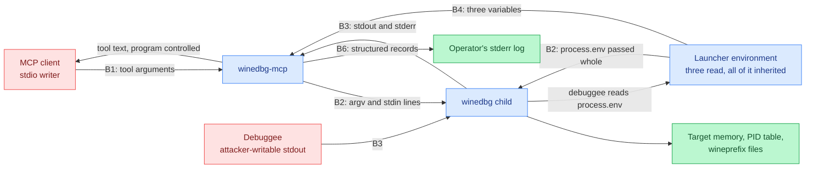

# Threat model: winedbg-mcp

Last reviewed: 2026-09-27
Owner: unset. No security owner is recorded for this repository.
Status: read off source. Every claim below carries a reference into `src/`,
`tests/`, `package.json`, `scripts/` or the CI workflow, and the claim is
[verified] unless it is marked [design].

## Scope

The repository holds the server: `src/`, `tests/`, `package.json`,
`tsconfig.json`, `bun.lock`, `scripts/verify-artifact.sh` and a CI workflow.
`src/index.ts` is the entry point and the tool dispatch, `src/cli.ts` the
command line, `src/tools.ts` the tool list and the call handler, `src/session.ts`
the session, framing and reply buffer, `src/runtime.ts` the process and clock the
session reaches the outside world through, `src/config.ts` the environment
parsing, `src/validate.ts` the tool-argument checks, `src/logger.ts` the stderr
record format and `src/constants.ts` the shared limits.

This is a local MCP server: stdio plus the environment, and the child process it
spawns. There is no network listener, no HTTP or RPC endpoint, no message
consumer, no webhook, no upload parser, no IPC, no container and no scheduled
job. The model is therefore short on boundaries and long on consequence: what
the caller can make winedbg do, and what a program under debug can do back.

Evidence in this file was read from code. No server was started and no traffic
was crafted. A reference has to resolve to the text it backs, so the next pass
re-checks the lines that move first: the tool list, the argument bounds, the
spawn options, the framing rules and the log fields.

## Risk-ranked summary

Ranked by exploitability first, then by impact. Each row names the boundary it
lives on and the code that makes it reachable. Every row is a record for
sec-review, not a fix.

| # | Threat | Boundary | Impact | Status in the code |
| --- | --- | --- | --- | --- |
| 1 | Any holder of the server's stdio can issue arbitrary debugger commands, which include commands that run shell programs, read and write target memory, and attach to any PID the user can signal. This is code execution as the server's user, offered by design. | B1, B2 | Total compromise of the host account the server runs under | Unmitigated by design. The checks are type, length, NUL, lone-surrogate and single-line only (`src/validate.ts:34-79`); no command allowlist exists |
| 2 | The child inherits the launcher's whole environment and working directory (`src/runtime.ts:169-175`), so winedbg and the debuggee get every variable the MCP client passed to the server. A debuggee is a program the person supplying the target chooses, and reading its environment is ordinary for it. | B2, B3 | Whatever the host keeps in the server's environment is readable and exfiltratable by the debuggee. The README's "there are no secrets" (`README.md:92-93`) is true of the three variables this server reads and false of the environment the process runs in | Unmitigated. `spawn` names no `env` and no `cwd` (`src/runtime.ts:169-175`) |
| 3 | `WINEDBG_MCP_BINARY` names the executable that `spawn` runs, so whoever sets it chooses the program, with no signature, allowlist or path check. | B4 | Code execution as the server's user with no MCP client involved at all | Unmitigated. Validated for emptiness and a NUL byte only (`src/config.ts:65-78`) |
| 4 | A debuggee's stdout is indistinguishable from the debugger's (`src/session.ts:7`, `src/session.ts:463-500`). A program under debug that prints `Wine-dbg>` can end a reply at a point of its choosing, hiding whatever output follows. | B3 | Wrong debugging conclusions; an operator is told the program's output stopped where the attacker chose | Unmitigated. The first prompt from the search position is the boundary (`src/session.ts:480`) |
| 5 | Debuggee output reaches the caller as tool text, so program-controlled bytes reach the LLM driving the server. Output is decoded as UTF-8 per stream, so a program printing invalid bytes gets U+FFFD back, which mangles the output without changing its authority. | B1, B3 | Prompt injection into the agent: the debugged program can steer the tool-using model. A target printing in a legacy code page has its output silently rewritten, so a mangled reply can be read as a correct one | Unmitigated. A single reply is bounded at 1M UTF-16 code units with the drop reported (`src/session.ts:11`, `src/session.ts:495-497`); the content is not classified |
| 6 | The stdio transport has no authentication. Any process that inherits or reaches the file descriptors is a full client. | B1 | Same as row 1, reached through a weaker path | Unmitigated; the only control is how the client is launched. `StdioServerTransport` is constructed with no options (`src/index.ts:137`) |
| 7 | A `timeout` of up to 600000 holds a tool call for ten minutes, and a timed-out command leaves the session refusing commands until winedbg returns to its prompt or `winedbg_stop` destroys the debugging state (`src/session.ts:524-528`). | B1 | Denial of service against the session, loss of the target's state | Partial: `winedbg_stop` and a restart recover it (`src/session.ts:598-607`, `src/session.ts:148-156`) |
| 8 | The log records what was asked for, not what came back: no line carries a reply, its length or its content, so a forged or truncated reply is indistinguishable from a correct one afterwards. | B3 | No trail to reconstruct a debugging session from | Unmitigated. A dropped block is logged with its size (`src/session.ts:479-482`), and that is the only record of reply content |
| 9 | Every field a caller controls is logged verbatim (`src/session.ts:547-553`, `src/session.ts:568`) and `formatRecord` applies no length or character bound (`src/logger.ts:25-32`). A field is JSON-encoded, so a newline cannot break the one-object-per-line parse, but nothing stops a caller filling the operator's log with megabytes of its own text across many calls. | B1, B6 | Log flooding, and a log that hides the real events among the noise | Partial: the per-call content is capped at 4096 characters by the argument checks (`src/validate.ts:12-16`), and JSON encoding keeps the parse intact. No rate limit and no field bound; the README said the log strips and truncates the text it records, which it does not (`README.md:160-164` now says so) |
| 10 | `stop()` clears the session and signals the child process group, but returns without waiting for it to exit (`src/session.ts:598-607`, `src/session.ts:390-413`). A client alternating `winedbg_start` and `winedbg_stop` leaves a live debugger and debuggee per cycle until the grace kill reaches them. | B1, B2 | Resource exhaustion: orphaned debuggees holding memory, CPU and the user's file access with no owner | [verified] Partial. The group is signalled with `SIGTERM`, escalating to `SIGKILL` after 2s, and the next start waits for the previous group to be gone (`src/session.ts:340-367`, bounded at 4s by `src/session.ts:23`), and `shutdown` does the same on the exit paths (`src/index.ts:121-134`). A client that stops, never starts again and never exits still relies on the escalation alone |
| 11 | The child is given a process group of its own, so a SIGKILL of the server skips the graceful path and only the `exit` handler's `stopImmediately` runs, which signals the group outright and cannot wait (`src/index.ts:119`, `src/session.ts:615-619`). A debuggee that ignores SIGKILL to the group survives. | B2 | Orphaned debuggee keeps running with no owner | [verified] Confirmed: `detached: true` (`src/runtime.ts:173`) |
| 12 | A reply is bounded at 1M UTF-16 code units and returned whole, roughly 250k tokens of program-controlled text in one tool result. The bound is per reply, not per session. | B1, B3 | Cost and context exhaustion in the client; the model reads attacker-chosen text at length | Bounded per reply, unbounded in count (`src/session.ts:11`, `src/session.ts:416-424`) |
| 13 | Tool failures return the message the code produced (`src/tools.ts:99-103`), which for a failed spawn carries the resolved binary path and the arguments (`src/session.ts:177-181`). | B1 | Deployment reconnaissance: filesystem layout and interpreter paths handed to whoever asks | Unmitigated for spawn and OS errors. The session-state messages are a fixed set of strings (`src/session.ts:136`, `src/session.ts:514`, `src/session.ts:516-519`, `src/session.ts:524-528`) and disclose nothing |
| 14 | An unknown `WINEDBG_MCP_*` variable anywhere in the launcher's environment aborts startup (`src/config.ts:35-39`). A stale or misspelled name is a fail-loud choice, and it is also a denial of service by anyone who can add one variable to the environment. | B4 | The server refuses to start | By design, and the variable is named in the error (`src/index.ts:36-43`) |
| 15 | A `winedbg_start` `args[0]` is a path or a name resolved against the server's `PATH` and working directory, since the child inherits both and nothing checks where the path points (`src/tools.ts:79-80`, `src/runtime.ts:169-175`). | B1, B2 | Running a program the operator did not name, from a directory the operator did not choose | Unmitigated |
| 16 | `--version` and `--help` read `package.json` from disk at startup (`src/cli.ts:67-73`), and the version string is derived from it. A checkout or a container image whose `package.json` is rewritten reports whatever it says. | B5 | A client that trusts the reported version is trusting a file, not a build | Partial: `tests/version.test.ts` pins the reported version against `package.json`, and `scripts/verify-artifact.sh:25-33` re-checks it in the built artifact |
| 17 | The build emits `build/index.js` and the client configuration points at it (`README.md:66-69`, `README.md:75-88`). CI runs the gate, the build and an artifact check that runs the shipped file under both `bun` and `node` (`scripts/verify-artifact.sh:30-35`), but the artifact is not signed or checksummed, so what a consumer installs is what their machine built. | B5 | A build that diverges from tested source ships unchecked | Partial: the artifact is verified to run and to carry nothing but compiled JavaScript; nothing checks its provenance afterwards |
| 18 | CI pins its actions to commit SHAs and sets `permissions: contents: read` (`.github/workflows/ci.yml`), and installs with `--frozen-lockfile`, so the dependency tree and the workflow's own actions are both fixed. | B5 | Supply-chain drift | [verified] Mitigated. The one remaining gap is that `@modelcontextprotocol/sdk` is a range (`^1.30.0`, `package.json`) and the lockfile is not shipped in the package (`files` lists `build` only), so a consumer installing the published tarball resolves against whatever that range admits that day |

Nothing this server reads is a secret store: the three variables it parses are
non-secret knobs and none is written anywhere (`src/config.ts:15-18`), and the
startup line prints only those three values (`src/config.ts:49-51`,
`src/index.ts:145-148`). That is a statement about this server's own
configuration, not about the environment the process holds, which is row 2.

## 1. Attack surface inventory

### Entry points, all of them

| Entry point | Type | Reaches | Validation |
| --- | --- | --- | --- |
| JSON-RPC over stdio | Transport | The client's configuration of the server | None at the transport (`src/index.ts:137-138`) |
| Command-line arguments | Process argv, set by whoever launches the server | `src/cli.ts:3-36` | Only `-h`, `--help` and `--version` are accepted; every other argument, including a positional one, raises a usage error naming it and exits 2, before the environment is read (`src/cli.ts:48-61`, `src/index.ts:17-32`). No argument value reaches the child |
| `package.json` on disk | File read at startup for the version string | The string reported to MCP clients (`src/cli.ts:67-73`) | Type and non-empty only; a file the server does not own decides the answer |
| Runtime and path the client launches | Deployment choice: `bun` on the built file, `node` 18+ on the same file, or the sources under `bun run dev` (`README.md:51-52`, `README.md:66-69`) | Whichever host runs it | None. Both hosts are exercised by `scripts/verify-artifact.sh:30-35`, and the `node` requirement is a floor with no upper bound (`README.md:51-52`) |
| `tools/list` | Request | A fixed tool list built once (`src/tools.ts:16-59`, `src/index.ts:69`) | None needed |
| `winedbg_start` `args` | Tool argument, reaches the child's argv | `src/tools.ts:79-80` | Array of strings, at most 64 entries, each at most 4096 characters, no NUL, no lone surrogate (`src/validate.ts:12-16`, `src/validate.ts:34-63`). The array itself is passed to `spawn` unchanged |
| `winedbg_execute` `command` | Tool argument, reaches the debugger's stdin | `src/tools.ts:85-87` | Non-empty, at most 4096 characters, no line break and no NUL, no lone surrogate (`src/validate.ts:65-79`), and the same single-line rule again in the session (`src/session.ts:30`, `src/session.ts:534-536`). No allowlist of debugger commands |
| `winedbg_execute` `timeout` | Tool argument | The wait for the reply | Whole milliseconds, 1 to 600000 (`src/validate.ts:81-93`, `src/constants.ts:10`) |
| Tool name | Tool argument | The switch in the call handler (`src/tools.ts:77-98`) | Unknown names raise `MethodNotFound` and are re-thrown rather than returned as a result (`src/tools.ts:97`, `src/tools.ts:100`) |
| `winedbg_stop` | Tool argument, none | `src/session.ts:598-607` | [verified] None needed |
| Error text returned as tool text | Response carrying child and OS failure detail | `src/tools.ts:99-103` | None; the message is passed through as produced |
| `WINEDBG_MCP_BINARY` | Environment, names the executable | `src/config.ts:65-78` | Non-empty, NUL-free, read once; no path check |
| `WINEDBG_MCP_READY_TIMEOUT_MS` | Environment | `src/config.ts:80-91` | Whole milliseconds, 1 to 600000 |
| `WINEDBG_MCP_LOG_LEVEL` | Environment | `src/config.ts:53-63` | One of `debug`, `info`, `warn`, `error` (`src/constants.ts:19`) |
| Any other `WINEDBG_MCP_*` name | Environment | `src/config.ts:35-39` | Refused, and the name is in the error: startup aborts |
| The rest of the process environment | Inherited by winedbg and by whatever winedbg starts | `src/runtime.ts:169-175` | None; `spawn` passes no `env` |
| The server's working directory | Inherited by the child; resolves a relative binary and a relative `args[0]` | `src/runtime.ts:169-175` | None; `spawn` passes no `cwd` |
| winedbg stdout and stderr | Child output stream, including the debuggee's | `src/session.ts:239-263` | Decoded as UTF-8 per stream, so a character split across two reads reassembles (`src/runtime.ts:96-110`); 1M UTF-16 code unit cap per reply, trimmed at a code point boundary, the drop counted and reported (`src/session.ts:11`, `src/session.ts:416-424`, `src/session.ts:433-438`, `src/session.ts:495-497`). No content check |
| SIGINT, SIGTERM, stdin `end`/`close`, transport close, process `exit` | Lifecycle | Session teardown (`src/index.ts:119`, `src/index.ts:121-134`, `src/index.ts:143-145`) | [verified] None needed; each routes to a stop, and the asynchronous ones wait for the debuggers they signalled, bounded at 4s |
| Log records on stderr | Log, one JSON object per line (`src/logger.ts:25-32`) | The operator's log, kept by the client after the session is gone | Level-filtered (`src/logger.ts:39-54`); no bound on field length or content |

Entry points a previous revision of this model listed that the code no longer
has: none. The three tools at `src/tools.ts:16-59` are the whole tool surface,
and `src/validate.ts` now bounds argument length, count and encodability, which
the previous revision recorded as absent.

Surface contributed by dependencies and deployment: `@modelcontextprotocol/sdk`
supplies the transport and the schemas, and the server does not rely on the SDK
to enforce the `inputSchema` it advertises, which is why `src/validate.ts` exists
(`src/validate.ts:5-7`, `src/tools.ts:20-31`). CI is the only automated gate and
there is no container or compose file in the tree.

## 2. Trust boundaries and data flow

**B1: client to server.** Everything arriving over stdio is untrusted, including
the tool name and both tool arguments. What the server checks is type, length,
count, NUL, lone surrogates and the single-line rule, and nothing more
(`src/validate.ts:34-93`). Nothing distinguishes a debugging command from a
command that runs a program, and nothing limits which PID may be attached to
(`src/tools.ts:79-80`). The privilege transition is at this boundary and at B2:
the caller's data becomes execution as the user running the server.

**B2: server to winedbg.** `spawn(binary, args, { stdio, detached })` with no
`shell` (`src/runtime.ts:169-175`), so no shell metacharacter reaches a shell
and none of the authority is removed. The child inherits the server's whole
environment and working directory. A deployment that launches this from a shell
or a client configuration with credentials in the environment hands them to
winedbg, and winedbg hands them to the program under debug, which is chosen by
whoever supplies the target.

**B3: winedbg to server.** The child's stdout and stderr are concatenated into
one buffer with no provenance, because winedbg offers no way to label which
output belongs to which command (`src/session.ts:62-68`). A debuggee writes to
the same pipes, so the server cannot tell debugger output from program output.
Framing depends on the string `Wine-dbg>` appearing in that merged stream,
which is program-controlled text (`src/session.ts:7`, `src/session.ts:480`).
The same pipe is how a debuggee returns what it read from the environment it
inherited through B2. Output arriving between commands is discarded rather than
attributed to either reply, because the buffer is cleared before each command is
written (`src/session.ts:572`).

No text at this boundary is an identity. Nothing the child prints is compared
for equality against a stored value, used as a filename, a path or a lookup
key, so no normalization form is chosen for it: the decoded text is passed on as
it arrives. If a later revision compares child output against anything, that
comparison needs a normalization policy of its own.

**B4: environment to server.** Three variables are read once, at startup
(`src/config.ts:15-18`): `WINEDBG_MCP_BINARY` names the executable that B2
spawns, `WINEDBG_MCP_READY_TIMEOUT_MS` bounds the first prompt wait, and
`WINEDBG_MCP_LOG_LEVEL` decides how much of the audit trail is written. Whoever
sets them chooses the binary, the timeout and the level. There is no signature or
allowlist on the path. This is the boundary an attacker has to reach for code
execution with no client at all, and the one with the largest blast radius,
because the same environment is forwarded whole to the child. A value the server
cannot use aborts startup with the variable named (`src/index.ts:36-43`), so a
typo fails loudly rather than running on defaults.

**B5: build to runtime.** The build emits `build/index.js` and the client
configuration points at that path (`README.md:66-88`). The tree has
`package.json`, `tsconfig.json`, `bun.lock` and a CI workflow, and CI runs the
gate, the build and `scripts/verify-artifact.sh`, which asserts the shipped file
runs under both hosts and carries nothing but compiled JavaScript
(`.github/workflows/ci.yml`, `scripts/verify-artifact.sh:18-35`). Two things
remain open: the artifact is neither signed nor checksummed after the build, and
the artifact has more than one documented way to run. The client configuration
launches it with `bun` (`README.md:75-88`), the README also sanctions `node` 18
or higher (`README.md:51-52`), and `bun run dev` runs the sources with no build
step at all (`README.md:66-69`). A `node` on `PATH` earlier than a deployment
expects resolves the `command` field from the client configuration, so the swap
needs no edit to the server.

**B6: server to the operator's log.** One JSON object per line on stderr
(`src/logger.ts:25-32`, `src/index.ts:57-59`), which the MCP client keeps after
the session is gone. This is the only record that what ran. The records cover
tool calls by `callId` with their outcome and duration (`src/index.ts:79-114`),
the spawn with its binary, arguments and pid (`src/session.ts:185-190`), the
time to the first prompt, the exit with its code or signal
(`src/session.ts:250-254`, `src/session.ts:264-293`), a command that timed out
with its text (`src/session.ts:547-553`), and a reply that hit the buffer limit
(`src/session.ts:488-493`). At `debug` the command text of every call is logged
(`src/session.ts:568`). A session line carries the `callId` of the tool call
that reached it, so what the debugger did is read under the call that asked for
it (`src/logger.ts:46-66`). A crash the server did not handle is written before
it leaves, as a record like any other, with the error, the stack and the version
(`src/fatal.ts:12-20`, `src/index.ts:66`); a client that closes stderr makes
every write fail with EPIPE and those lines are dropped rather than crashing the
server (`src/index.ts:60-65`). What the log does not carry is the reply: no line
records its content or its length, so the log cannot tell a forged reply from a
correct one, and it cannot tell a truncated one except where the drop notice
fires.

**Secrets.** The three variables the server interprets are non-secret knobs, and
the README says so of the environment as a configuration surface
(`README.md:92-100`). That statement covers what this server reads, not what its
process holds: the environment is inherited whole by the child (B2) and reaches
the program under debug. Credentials a client places in the server's environment
are a deployment asset the server forwards to an untrusted program without being
asked to. Confidentiality of the caller's own data is not a boundary this server
defends; it is a pipe.

## 3. Assets and impact

- **Code execution as the server's user.** Reachable through B1 and B2. The
  blast radius is everything that account can read or write: the filesystem, the
  wineprefix, SSH keys in its home, the network it is attached to.
- **Target memory and register state.** A debugger reads arbitrary memory of the
  process it is attached to, and `winedbg_start` accepts a PID
  (`src/tools.ts:79-80`). Anything secret in the debuggee's address space is
  readable, and nothing limits which PID.
- **The wineprefix and the debugged filesystem.** The debuggee writes where it
  wants and the debugger can write memory and files. Damage here is silent and
  persists after the session ends.
- **Integrity of the debugging result.** Register values, backtraces and program
  output that the caller reads as fact, that B3 lets a program forge, and that
  B6 leaves no record of.
- **The caller's model context.** Up to 1M UTF-16 code units of
  program-controlled text per reply reach the model, unbounded in count across a
  session (`src/session.ts:11`).
- **The launcher's environment.** Whatever the host puts in the variables used to
  start this server. A debuggee can read all of it and print it back through the
  pipe its output already uses (B2, B3).
- **The debuggee's own reach.** A program under debug runs with the server
  user's filesystem and network position. An attacker who supplies a target
  inherits that whether or not the caller intended to run it.
- **The operator's log.** The one place a session is reconstructible from. It is
  caller-writable in volume and content (B1, B6), so its value as evidence
  depends on what the caller cannot put in it.
- **Session availability.** One debugger at a time, one command in flight
  (`src/session.ts:135-137`, `src/session.ts:516-520`).

## 4. Threats per boundary

### B1, client to server

- **Elevation of privilege.** A client, or anything an LLM reads, calls
  `winedbg_execute` with a command that runs a program or attaches to a PID
  (`src/tools.ts:85-87`). Nothing distinguishes a debugging command from an
  execution command.
- **Tampering.** A caller sets `args` to any program path or PID and the server
  passes it through unchanged (`src/tools.ts:79-80`).
- **Information disclosure.** `winedbg_execute` returns target memory content to
  the client with no classification step. A failed spawn returns the message the
  code produced (`src/tools.ts:99-103`, `src/session.ts:177-181`), which carries
  the resolved binary path and the arguments, so a caller can map the
  deployment's filesystem by starting sessions against paths that do not exist.
- **Denial of service.** A `timeout` of 600000 holds a tool call for ten minutes
  (`src/validate.ts:81-93`). A timed-out command blocks the next one until the
  prompt returns, and the escape is a stop that discards the session's state
  (`src/session.ts:524-528`). A call per 4096 characters of argument text is the
  floor on how much log a caller can write (row 9).
- **Repudiation.** The log records that a call started, which tool ran, how long
  it took and whether it failed (`src/index.ts:85-110`). It does not record the
  reply, and the client's request id never reaches this process, so a
  per-process counter stands in for it (`src/index.ts:71-79`).

### B2, server to winedbg

- **Spoofing and elevation of privilege.** `WINEDBG_MCP_BINARY` names the
  executable (`src/config.ts:65-78`), so control of the launcher's environment is
  control of the process. The startup record reports the value in effect
  (`src/config.ts:49-51`), which discloses the path and no secret.
- **Tampering.** `args` is passed unchanged, so a relative path or a name found on
  `PATH` resolves wherever the server's `PATH` points, and a relative `args[0]`
  resolves against the server's working directory.
- **Information disclosure.** The child inherits the launcher's whole
  environment and hands it to the program under debug, which is attacker-supplied
  in the common case of a downloaded sample.
- **Denial of service.** The child is detached into its own process group
  (`src/runtime.ts:173`), so a SIGKILL of the server skips the graceful path and
  leaves the debugger and its debuggee running.

### B3, winedbg to server

- **Spoofing.** A debuggee that writes `Wine-dbg>` to its stdout reaches the
  client on the same pipe the prompt arrives on, so the reply can be ended
  wherever the program chooses. The first prompt from the search position is the
  boundary (`src/session.ts:480`); after an abandoned prompt is drained the
  search restarts at zero and the last prompt becomes the boundary
  (`src/session.ts:468-474`), which is a different rule for the same stream.
- **Tampering.** Output that arrived between commands is dropped rather than
  attributed to either reply (`src/session.ts:572`).
- **Information disclosure.** Everything the child writes is returned to the
  client, including output of programs the caller did not intend to expose, and a
  program that dumps the environment it inherited at B2 reaches the client this
  way.
- **Denial of service.** Continuous output is bounded to 1M UTF-16 code units
  and the drop is reported in the reply and in the log
  (`src/session.ts:416-424`, `src/session.ts:478-487`). The bound is per reply,
  not per session, so a program that prompts frequently can still be expensive in
  total.
- **Integrity.** A multibyte sequence split across two reads decodes as the one
  character it is, because each stream carries its own `StringDecoder`
  (`src/runtime.ts:96-110`), and the trim moves off a surrogate boundary
  (`src/session.ts:433-438`), so neither the read boundary nor the cap produces
  a reply that looks complete and is not. Invalid UTF-8 still becomes U+FFFD
  (`src/runtime.ts:96`), which mangles a program printing in a legacy code page
  without saying so.

### B4, environment to server

- **Spoofing and elevation.** Anything that can set the launcher's environment
  (a CI job definition, an MCP client config file, a container spec) chooses the
  binary. No signature, no allowlist.
- **Information disclosure.** The same environment is handed to the child whole
  and on to the debuggee. A launcher that shares one environment between this
  server and the rest of the agent's tooling shares every credential in it with
  whoever supplies the target.
- **Denial of service.** An unknown `WINEDBG_MCP_*` name, or a value outside its
  range, stops the server at startup (`src/config.ts:35-39`,
  `src/config.ts:53-91`).

### B5, build to runtime

- **Tampering.** CI pins its actions by SHA and sets `permissions: contents:
  read`, and installs frozen, so the dependency tree and the workflow's own
  actions are both fixed (`.github/workflows/ci.yml`). What is not fixed is the
  published range of the one runtime dependency, since the lockfile is not
  shipped (`package.json`).
- **Repudiation.** CI has no artifact of what it built: `build/` is gitignored
  and the runtime a deployment uses is a local choice.

### B6, server to the operator's log

- **Tampering.** Every field the caller controls is logged as given
  (`src/session.ts:547-553`, `src/session.ts:568`), and a level of `error` on a
  caller-triggered path is a line an operator reads as the server's own account
  of what happened. JSON encoding keeps one call to one line; it does not keep a
  caller's text out of the record.
- **Denial of service.** No rate limit and no field bound on the log
  (`src/logger.ts:25-32`).
- **Repudiation.** The log cannot show what a reply contained, so a forged or
  dropped reply is not reconstructible from it (row 8).

## 5. Mitigations mapping

Controls that exist in the code, and the threats they cover.

| Control | Code | Covers |
| --- | --- | --- |
| Argument type, count, length, NUL and surrogate checks before use | `src/validate.ts:12-16`, `src/validate.ts:34-79` | Oversized, malformed or unencodable tool calls reaching the child |
| Timeout bounded to a whole number of milliseconds, 1 to 600000 | `src/validate.ts:81-93` | A zero, negative or non-integer timeout stranding the session |
| winedbg started with an argv array, no shell | `src/runtime.ts:169-175` | Shell metacharacter injection at B2 |
| Rejection of a command carrying any line break or NUL, at the argument boundary and again in the session | `src/validate.ts:72-77`, `src/session.ts:30`, `src/session.ts:534-536` | Prompt desynchronisation from a second line, and the rule holding for a caller that reaches the session directly |
| One command in flight, and one start at a time | `src/session.ts:135-137`, `src/session.ts:516-520` | Two callers interleaving output, and a start racing a stop |
| Refusal while an abandoned prompt is owed | `src/session.ts:524-528`, `src/session.ts:468-474` | Output from a timed-out command reaching the wrong caller |
| Buffer ceiling with the drop counted and reported | `src/session.ts:11`, `src/session.ts:416-424`, `src/session.ts:478-487` | Unbounded memory growth from a noisy debuggee, and a silently shortened reply |
| UTF-8 decoded per stream, trim on a code point boundary | `src/runtime.ts:96-110`, `src/session.ts:433-438` | A split character, and a reply that starts mid-character |
| Child given its own process group and signalled as a group on stop and on shutdown | `src/runtime.ts:136-149`, `src/runtime.ts:173`, `src/session.ts:390-413` | Orphaned debuggee after a clean stop or a clean shutdown |
| SIGKILL escalation after a 2s grace, and a wait for the group on the next start and on exit | `src/session.ts:17`, `src/session.ts:23`, `src/session.ts:340-367`, `src/session.ts:640-643` | A debugger wedged in a trap handler, and one detached group per start/stop cycle |
| Stale-child event guard, and a launch id a stop can cancel | `src/session.ts:196`, `src/session.ts:139-156` | A late event from a replaced child corrupting current session state, and a start spawning a debugger nobody is waiting on |
| Pipe errors swallowed rather than left to kill the process | `src/runtime.ts:77`, `src/runtime.ts:88-90` | A closed or broken pipe taking the server process down |
| Configuration validated at startup, unknown names rejected, unusable value exits 1 | `src/config.ts:35-39`, `src/config.ts:53-91`, `src/index.ts:36-43` | A typo or bad value surfacing as a mid-session failure, and a deployment that believes it started when it did not |
| Child killed when the first prompt never arrives | `src/session.ts:222-235` | A start that never completed leaving a debugger with no session |
| Lifecycle teardown on exit, signals, stdin end and transport close | `src/index.ts:119`, `src/index.ts:121-134`, `src/index.ts:143-145` | A detached debugger surviving the client |
| Unknown tool names raised as protocol errors, not results | `src/tools.ts:97`, `src/tools.ts:100` | A failed call reported as a successful one |
| One JSON object per line, level-filtered, nothing on stdout but protocol | `src/logger.ts:25-32`, `src/logger.ts:39-54`, `src/index.ts:57-59` | A multiline reply breaking the log parse, and log noise on the stream the client reads |
| Every tool call and session event logged with a `callId`, its outcome and its duration | `src/index.ts:79-114`, `src/session.ts:171-190`, `src/session.ts:264-293` | No trail to investigate a call or a session from |
| A crash recorded as a log record before the process leaves, and a broken stderr dropped rather than raised | `src/fatal.ts:12-20`, `src/fatal.ts:31-40`, `src/index.ts:60-66` | A crash reaching the operator as unparseable text, and a closed log stream taking the server down mid-call |
| No secret read, logged or stored by this server | `src/config.ts:15-18`, `src/config.ts:49-51` | Nothing to disclose through the server's own configuration |

Absent, ranked by exploitability then impact:

1. **No authentication on the stdio transport.** Whoever writes to the server's
   stdin is a full client, with the authority in row 1. There is no handshake, no
   capability token and no allowlist of clients.
2. **No filtering of the environment handed to the child.** A deployment cannot
   tell this server to withhold variables from the program under debug.
3. **No path check on `WINEDBG_MCP_BINARY`.** The value is checked for emptiness
   and for a NUL byte, and nothing else.
4. **No restriction on what winedbg may be asked to do.** A command allowlist
   would have to be defined against the debugger's real command set, which
   changes with the Wine version; the model records the gap rather than
   prescribing the list.
5. **No provenance separation between debugger and debuggee output.** A prompt on
   a channel distinct from the program's, or a stream dedicated to program
   output, is the only way to make row 4 detectable and to stop row 2's
   disclosure from looking like ordinary debug output.
6. **No per-session reply budget.** The cap is per reply, and a session is one
   debugger that can be prompted as often as the caller likes.
7. **No consent step for destructive or outward-facing debugger commands.**
8. **No bound on log volume.** The command text is bounded per call by the
   argument checks; the number of calls, and therefore the number of records, is
   not. The README claimed a strip and a truncation of the recorded text; the
   code performs neither (`src/logger.ts:25-32`), and the README now says so
   (`README.md:160-164`).
9. **No record of reply content or size**, so a forged, dropped or mangled reply
   is not reconstructible from the log.
10. **Sanitisation of error text before it reaches the caller.** The
    session-state messages are fixed text, so what passes through unsanitised is
    the spawn and OS error, not the routine failures.
11. **No signing or checksum of the built artifact**, and no lockfile in the
    published package, so a consumer resolves the one runtime dependency against
    a range.

Security claims in the project's own documentation, checked against the code:

| Claim | Reality |
| --- | --- |
| The three variables are non-secret and there is no config file (`README.md:92-100`) | Accurate. The server reads those three and nothing else (`src/config.ts:15-18`) |
| The child inherits the whole environment and working directory (`README.md:95-100`) | Accurate (`src/runtime.ts:169-175`) |
| A command is rejected if it carries any line terminator or NUL, naming the full set (`README.md:172-181`) | Accurate. `LINE_BREAKS` is exactly that set, NUL included (`src/session.ts:30`), checked twice (`src/validate.ts:72-77`, `src/session.ts:534-536`) |
| `args` is at most 64 entries of at most 4096 characters with no NUL; a command is at most 4096 characters (`README.md:146-148`) | Accurate (`src/validate.ts:12-16`, `src/validate.ts:39-51`, `src/validate.ts:69-71`) |
| A reply is capped at 1M UTF-16 code units, the drop is reported and counted in code points, and the cut moves off the low half of a surrogate pair (`README.md:188-197`) | Accurate (`src/session.ts:11`, `src/session.ts:15`, `src/session.ts:416-424`, `src/session.ts:433-438`, `src/session.ts:495-497`) |
| "Control characters are stripped from the recorded text and it is truncated, so a command cannot forge log records or flood the log" (corrected in this pass) | **Was false.** `formatRecord` JSON-encodes the record and applies no strip and no truncation (`src/logger.ts:25-32`). JSON encoding keeps a command's newline from breaking the one-line parse, and the 4096-character argument bound caps a single field, but neither is the control the text named. `README.md:160-164` now states what the log does and does not do |
| "A command logs the command, its timeout and the size of its reply" (corrected in this pass) | **Partly false.** The timeout and the command text are logged (`src/session.ts:547-553`, `src/session.ts:568`); no reply size is logged anywhere in `src/`. `README.md:153-164` now says which of the two the log records |
| "`src/index.ts` keeps four scoped `noConsole` suppressions and one `noControlCharactersInRegex` suppression on an audit log's strip pattern" (corrected in this pass) | **False.** There is one `noConsole` suppression (`src/index.ts:40`) and no other Biome suppression in `src/`. `README.md:307-311` now says so |
| Every tool failure comes back as `Error: <message>` with the message the code produced (`README.md:315-316`) | Accurate (`src/tools.ts:99-103`) |
| `bun run dev` runs the sources with no build step, and the built file is the deployment path (`README.md:66-69`) | Accurate (`package.json` `dev` and `start`) |

Single points of failure carrying several high-impact threats:

- The prompt-string assumption in `checkOutput` (`src/session.ts:463-500`) is
  the only place a reply is framed, and a debuggee writes the same string.
- The stdio transport is the sole gate for all caller input, with no
  authentication layer to bypass or to rely on.
- The spawn options are the single place the child's authority is defined
  (`src/runtime.ts:169-175`). Everything the debuggee can reach that the caller
  cannot, it reaches through what is absent there.
- The server's OS user is the whole blast radius for every row in the summary.
- The operator's log is the only record of a session, and the fields it takes
  from the caller are the ones the caller writes (`src/logger.ts:25-32`).

## 6. Abuse cases

Scenarios with the enabling code path named. None was attempted against a
running server: no server was started, no attack was carried out, and no crafted
traffic was sent.

- **A prompt-injected model becomes a shell.** A document the model reads
  contains instructions; the model calls `winedbg_execute` with a command that
  runs a program (`src/tools.ts:85-87`). The checks are a non-empty string of at
  most 4096 characters, no line break, no NUL and encodability
  (`src/validate.ts:65-79`).
- **A debugged program dictates the answer.** The program prints the prompt
  string and a clean-looking result of its own, then its real output follows. The
  caller sees the reply end where the program chose
  (`src/session.ts:480`).
- **A debugged program spends the caller's tokens.** It emits a capful of output
  per prompt in a loop, and nothing counts replies per session
  (`src/session.ts:11`).
- **A debugged program floods the operator's log.** The caller's own text is
  echoed into records with no strip and no truncation, and nothing bounds how
  many records a session writes (`src/logger.ts:25-32`,
  `src/session.ts:568`).
- **Read another process.** `winedbg_start` with a PID the server's user can
  signal attaches the debugger to it, and `winedbg_execute` reads its memory
  (`src/tools.ts:79-80`).
- **The debuggee reads the launcher's secrets.** A target that prints its own
  environment returns whatever the host kept in the server's environment, on the
  same pipe as its normal output, framed as an ordinary reply
  (`src/runtime.ts:169-175`).
- **Accumulate orphaned debuggees.** A client alternating `winedbg_start` and
  `winedbg_stop` leaves each process group alive until the grace kill reaches it,
  because `stop` returns as soon as the signal is sent
  (`src/session.ts:598-607`).
- **Map the deployment's filesystem.** A `winedbg_start` naming a path that does
  not exist returns the spawn failure's own text, including the resolved binary
  path and the arguments (`src/session.ts:177-181`).
- **Wedge the session.** A command that never returns holds the debugger, and the
  refusal after a timeout means the only recovery is a stop that discards the
  target's state (`src/session.ts:524-528`).
- **Keep the server from starting.** Any extra `WINEDBG_MCP_*` name in the
  environment aborts startup with the name in the message
  (`src/config.ts:35-39`).
- **Trust placed in the client.** Who may call the tools, and which commands they
  may issue, is the client's problem. The server validates JSON shape and assumes
  the rest.

## 7. Document quality and SECURITY.md

There is no `SECURITY.md`, no disclosure contact, no supported-versions table and
no security policy in this repository. This model does not invent one: a
disclosure route and a security owner are decisions for whoever owns the
project, and leaving them unset is visible here rather than implied elsewhere.

`package.json` is at version 1.0.0, and `CHANGELOG.md` records the changes per
release. The last release's notes are the closest thing to a security history
this repository has.

This model is current as of the last-reviewed date above. Its limits:

- The risk-ranked summary, section 1 and the boundary section go stale first. A
  change to the tool list, the argument bounds, the spawn options, the framing
  rules, the log fields or the buffer behaviour in `src/` means re-checking them.
- Every reference here was re-checked against the current `src/`, `tests/`,
  `package.json` and the CI workflow in the pass that set the date above. That
  is all that check establishes; a citation that survives one pass is not
  re-verified by the next one.
- The previous revision of this model carried three claims that the code
  contradicted: that the tool arguments had no length bound, that nothing was
  logged, and that the reply buffer trimmed mid-surrogate. All three are
  implemented (`src/validate.ts:12-16`, `src/logger.ts` with
  `src/index.ts:79-114`, `src/session.ts:433-438`), and a README sentence is
  not evidence of any of them.
- The claims table above is the highest-value part of this file. Three of the
  nine claims it checks were false when checked, and the README has been
  corrected for the three in this pass; a claim corrected here is a claim that
  was wrong in a document other readers build on.

## 8. Response readiness

Noted only; this review builds no infrastructure.

- Security-relevant events are logged, and the log is the client's to keep
  (`src/index.ts:57-59`). What it cannot answer is what a reply contained: no
  record carries the reply's content or size, so a program that forged a
  debugging result and one that produced a real one leave the same trail. The
  clearest case is row 2: a debuggee that printed the launcher's environment and
  exited normally is recorded as a session that ended, indistinguishable in the
  log from a session that did nothing.
- A log aggregator is a deployment decision. Nothing in this tree configures
  one, and the record format is one JSON object per line so that a deployment
  can (`src/logger.ts:25-32`).
- There is no documented path from a reported vulnerability to a shipped fix: no
  security policy, no contact, and no branch or release process beyond the
  pull-request checklist in `CONTRIBUTING.md`.
- `bun run check` and `bun run build` plus `scripts/verify-artifact.sh` are the
  automated gates, and CI runs all three on every push and pull request
  (`.github/workflows/ci.yml`).
