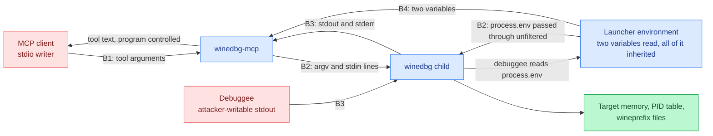

# Threat model: winedbg-mcp

Last reviewed: 2026-09-27
Owner: unset. No security owner is recorded for this repository.
Status: design-time. The summary and sections 2 to 6 are read off the README,
not checked against source, because this repository contains no source.

## Scope and verification status

This repository holds documentation only: `README.md` and this file. There is no
`src/`, no `package.json`, no `tests/`, no CI workflow and no lockfile
(`README.md:5-11` states this, and it is true of the tree). There is therefore
no executable surface here to model, and no entry point, boundary or mitigation
in this document can be re-verified against code.

The server this model describes is specified in prose in `README.md`. Every
claim below is therefore split by how it is supported:

- **[design]** is read off the README or off the intended architecture, and is
  not confirmed by any file in this repository.
- **[verified]** is checked against a file in this tree, and carries a line
  reference that resolves here.

An earlier revision of this document cited line numbers in `src/index.ts`,
`src/session.ts`, `src/validate.ts`, `src/config.ts`, `package.json` and
`.github/workflows/ci.yml`. None of those files exist on the branch this document
was written on, or anywhere in that branch's history. The numbers were
unverifiable here, so they are gone: an unresolvable line reference is worse
than none, because a reader assumes it was checked. What replaced them is a
`README.md` line, which does resolve. Where the code location matters and
cannot be cited, the model names the file the control belongs in and marks it
unanchored.

When the server lands, re-verify this model before relying on it. Section 7 says
what to check first.

## Risk-ranked summary

Every row is **[design]**: read off `README.md` and the intended architecture,
not confirmed against source. The Status column is the model's judgement of
whether the described design covers the threat, not a statement about code in
this repository.

| # | Threat | Boundary | Impact | Status |
| --- | --- | --- | --- | --- |
| 1 | Any holder of the server's stdio can issue arbitrary debugger commands, which include commands that run shell programs, read and write target memory, and attach to any PID the user can signal. This is code execution as the server's user, offered by design. | B1, B2 | Total compromise of the host account the server runs under | Unmitigated by design; the only control is who can reach the stdio |
| 2 | The child inherits the launcher's whole environment and working directory (`README.md:60-65`), so winedbg and the debuggee get every variable the MCP client passed to the server. A debuggee is a program the person supplying the target chooses, and reading its environment is ordinary for it. | B2, B3 | Whatever the host keeps in the server's environment is readable and exfiltratable by the debuggee. It reaches the model as "the environment holds no secrets" (`README.md:57-58`), which is true of the two variables this server reads and false of the environment the process runs in | Unmitigated |
| 3 | A debuggee's stdout is indistinguishable from the debugger's (`README.md:91-93`). A program under debug that prints `Wine-dbg>` can end a reply at a point of its choosing, hiding whatever output follows. | B3 | Wrong debugging conclusions; an operator is told the program's output stopped where the attacker chose | Unmitigated |
| 4 | Debuggee output reaches the caller as tool text, so program-controlled bytes reach the LLM driving the server. It is decoded as UTF-8 first (`README.md:107-113`), so a program printing non-UTF-8 bytes is returned as U+FFFD, which mangles the output without changing its authority. | B1, B3 | Prompt injection into the agent: the debugged program can steer the tool-using model. A target that prints in a legacy code page has its output silently rewritten, so a mangled reply can be read as a correct one | Unmitigated |
| 5 | The stdio transport has no authentication. Any process that inherits or reaches the fds is a full client. | B1 | Same as #1, reached through a weaker path | Unmitigated; the only control is how the client is launched |
| 6 | If `stop()` clears the session before the process group is gone, a client alternating `winedbg_start` and `winedbg_stop` leaves a live debugger per cycle and can accumulate detached process groups faster than they die. | B1, B2 | Resource exhaustion: orphaned debuggees holding memory, CPU and the user's file access with no owner | Partial: a start that never reaches its prompt has its child killed (`README.md:149`), so that path does not orphan. `stop()` is still unstated; check the code |
| 7 | A timed-out command leaves the session refusing commands until `winedbg_stop` destroys the debugging state (`README.md:101-105`). | B1 | Denial of service against the session, loss of the target's state | Partial: `winedbg_stop` and restart recover it |
| 8 | A reply is buffered up to 1M characters and returned whole, roughly 250k tokens of program-controlled text in one tool result (`README.md:107-113`). | B1, B3 | Cost and context exhaustion in the client; the model reads attacker-chosen text at length | Bounded per reply, unbounded in count |
| 9 | Whether the child is given a process group of its own is not stated. If it is, the debugger and its debuggee survive a SIGKILL of the server. | B2, B4 | Orphaned debuggee keeps running with no owner | Unanchored; check the spawn options in the code |
| 10 | Tool failures return the message the code produced (`README.md:140-149`), which for a failed spawn carries the resolved binary path. | B1 | Deployment reconnaissance: filesystem layout and interpreter paths handed to whoever asks | Unmitigated for spawn and OS errors. The session-state errors are a fixed set of five strings (`README.md:143-149`) and disclose nothing |
| 11 | Nothing in the design records a command, an argument, a timeout or a reply size. | All | No trail to investigate an incident from | Unmitigated |
| 12 | The build emits `build/index.js` and the client configuration points at it (`README.md:28-34`, `README.md:40-53`), with no build, test or CI artifact in this repository to show the shipped file matches the sources. | B5 | A build that diverges from tested source ships unchecked | Unverifiable here |
| 13 | No published manifest, lockfile or CI workflow exists in this tree, so whether CI pins its actions and scopes its token, and what a consumer resolves, cannot be checked. | B5 | Supply-chain drift decided by whatever satisfies a range on the day of install | Unverifiable here |

Nothing this server reads is a secret store: the two variables it parses are
non-secret knobs and neither is written anywhere (`README.md:57-58`). That is a
statement about this server's own configuration, not about the environment the
process inherits, which is row 2. Confidentiality of the caller's data is not a
boundary this server defends; it is a pipe.

## 1. Attack surface inventory, as found in this tree

There is none. No network listener, no HTTP or RPC endpoint, no message
consumer, no webhook, no file or upload parser, no CLI argument parsing, no
environment variable read, no scheduled job and no IPC in this tree. Nothing
executes. The deployment artifacts a model would normally cite do not exist
here either: no Dockerfile, no compose file, no CI workflow, no lockfile.

The MCP server named in the title is not in this repository. What a security
owner can rely on today is the specification in `README.md`, and the sections
below model that specification.

### 1a. Entry points, as specified (design)

The complete entry-point set the README describes, which the next pass should
compare against `tools/list` when the code lands:

| Entry point | Type | Designation | Validation as described |
| --- | --- | --- | --- |
| JSON-RPC over stdio | Transport | client configuration, `README.md:40-53` | None at the transport |
| `winedbg_start` `args` | Tool argument, reaches the child's argv | `README.md:84` | None stated; the array is passed through unchanged, with no length or content check |
| `winedbg_execute` `command` | Tool argument, reaches the debugger's stdin | `README.md:85` | Non-empty, carrying no line terminator (`\n`, `\r`, vertical tab, form feed, NEL, U+2028, U+2029); no allowlist of debugger commands |
| `winedbg_execute` `timeout` | Tool argument | `README.md:86` | Bounded, 1 to 600000 ms |
| `winedbg_stop` | Tool argument, none | `README.md:87` | None needed; what it waits for before returning is unstated |
| Error text returned as tool text | Response carrying child and OS failure detail | `README.md:140-149` | None; the message is passed through as produced |
| `WINEDBG_MCP_BINARY` | Environment, names the executable | `README.md:67-70` | Non-empty, read once; an unknown `WINEDBG_MCP_*` name aborts startup (`README.md:72-76`) |
| `WINEDBG_MCP_READY_TIMEOUT_MS` | Environment | `README.md:67-70` | Whole milliseconds, 1 to 600000 |
| The rest of the process environment | Inherited by winedbg and by whatever winedbg starts | `README.md:60-65` | None |
| The server's working directory | Inherited by the child; resolves a relative binary and a relative `args[0]` | `README.md:60-65` | None |
| winedbg stdout and stderr | Child output stream, including the debuggee's | `README.md:91-93` | Decoded as UTF-8, 1M character cap per reply counted in decoded characters, dropped at character boundaries; no content check |
| Startup line on stderr | Log | `README.md:78-80` | Reports both configuration values in effect |

Signals and stream events the server must handle (shutdown, stdin `end`,
transport close) are not described in the README. They are unanchored: find
them in the code and add them to this table.

The one internal name the README gives is `WinedbgSession`, the class the
planned test suite drives against a stand-in speaking the same `Wine-dbg>`
protocol (`README.md:125-128`). That is where the spawn, the framing and the
reply buffer described throughout this model live, so the next pass should
start there rather than at the transport.

Entry points a previous revision of this model listed and the specification no
longer has: none. The three tools at `README.md:84-87` are the complete tool
surface as described.

## 2. Trust boundaries and data flow (design)

Read as the intended shape of the server, from `README.md`.

**B1: client to server.** Everything arriving over stdio is untrusted,
including the tool name and both tool arguments. The specified validation is
type and range checking. What the README states is that `winedbg_execute` takes
a command string and an optional timeout defaulting to 30000 with a maximum of
600000 (`README.md:85-86`), that a command carrying a line terminator is rejected
(`README.md:95-100`), and that `args` is a string array passed through unchanged
(`README.md:84`). Nothing in that description bounds argument length, restricts
which debugger commands may be sent, or distinguishes a debugging command from a
command that runs a program.

**B2: server to winedbg.** `winedbg_start` passes the caller's `args` through
unchanged, including a PID (`README.md:84`), and winedbg is a debugger whose
command set includes running and attaching to processes. Whether it is started
with an argument array and no shell, or through a shell, is not stated in the
README; if it is the former, no shell metacharacter reaches a shell, which
removes one class of injection and none of the authority. The privilege
transition is the point either way: at this boundary the caller's data becomes
execution as the user running the server.

The README records that winedbg is started with the server's whole environment
and working directory inherited (`README.md:60-65`). Nothing in the described
server filters them. A deployment that launches it from a shell or a client
configuration with credentials in the environment hands them to winedbg, and
winedbg hands them to the program under debug, which is chosen by whoever
supplies the target.

**B3: winedbg to server.** The child's stdout and stderr are concatenated into
one buffer with no provenance, because winedbg offers no way to label which
output belongs to which command (`README.md:91-93`). A debuggee writes to the
same pipe, so the server cannot tell debugger output from program output.
Framing depends on the string `Wine-dbg>` appearing in that merged stream,
which is program-controlled text. The same pipe is how a debuggee returns what
it read from the environment it inherited through B2, and nothing in the design
classifies what comes back.

**B4: environment to server.** Two variables are read once, at startup
(`README.md:57-58`, `README.md:67-70`): `WINEDBG_MCP_BINARY` names the executable
that B2 spawns, and `WINEDBG_MCP_READY_TIMEOUT_MS` bounds the first prompt
wait. Whoever sets them chooses the binary and the timeout. There is no
signature or allowlist on the path. This is the boundary an attacker has to
reach for code execution with no client at all. It is also the boundary with the
largest blast radius, because the same environment is forwarded whole to the
child. A value the server cannot use aborts startup with the variable named
(`README.md:72-76`), so a typo fails loudly rather than running on defaults.

**B5: build to runtime.** The README's build step emits `build/index.js` and
the client configuration points at that path (`README.md:28-34`,
`README.md:40-53`). Whether that artifact matches the sources is a
build-pipeline question this repository does not answer: there is no
`package.json`, no `tsconfig.json`, no lockfile, no CI workflow and no stated
dependency version. Two consequences follow, and both are unverifiable rather
than confirmed: nothing here verifies that the emitted artifact matches tested
source, and a consumer of a published binary would resolve dependencies from
whatever declared ranges the package carries, with no lockfile in reach.

**Secrets.** [verified] The two variables the server interprets are non-secret
knobs, and the README says so (`README.md:57-58`). [design] That statement
covers what this server reads, not what its process holds: the environment is
inherited whole by the child (B2) and reaches the program under debug
(`README.md:60-65`). Credentials a client places in the server's environment are
a deployment asset the server forwards to an untrusted program without being
asked to. Confidentiality of the caller's own data is not a boundary this
server defends; it is a pipe.

## 3. Assets and impact (design)

- **Code execution as the server's user.** Reachable through B1 and B2. The
  blast radius is everything that account can read or write: the filesystem,
  the wineprefix, SSH keys in its home, the network it is attached to.
- **Target memory and register state.** A debugger reads arbitrary memory of
  the process it is attached to, and `winedbg_start` accepts a PID
  (`README.md:84`). Anything secret in the debuggee's address space is
  readable, and nothing in the design limits which PID.
- **The wineprefix and the debugged filesystem.** The debuggee writes where it
  wants; the debugger can write memory and files. Damage here is silent and
  persists after the session ends.
- **Integrity of the debugging result.** Register values, backtraces and program
  output that the caller reads as fact, and that B3 lets a program forge.
- **The caller's model context.** Up to 1M characters of program-controlled text
  per reply reach the LLM (B1, `README.md:107-113`).
- **The launcher's environment.** Whatever the host puts in the variables used
  to start this server. A debuggee can read all of it and print it back through
  the same pipe its output already uses (B2, B3).
- **The debuggee's own reach.** A program under debug runs with the server
  user's filesystem and network position. An attacker who supplies a target
  inherits that whether or not the caller intended to run it.
- **Session availability.** One debugger at a time, one command in flight
  (`README.md:95-105`).

## 4. Threats per boundary (design)

Enumerate these against source when the code lands; the entry points are named
here, the code paths are not.

### B1, client to server

- **Elevation of privilege.** A client, or anything an LLM reads, calls
  `winedbg_execute` with a command that runs a program or attaches to a PID
  (`README.md:85`). Nothing in the design distinguishes a debugging command from
  an execution command.
- **Tampering.** A caller sets `args` to any program path or PID, and the server
  passes it through unchanged (`README.md:84`).
- **Information disclosure.** `winedbg_execute` returns target memory content
  to the client with no classification step. The README specifies that a tool
  failure returns the message the code produced (`README.md:140-149`), which
  for a failed spawn carries the resolved interpreter path and the OS error, so
  a caller can map the deployment's filesystem by starting sessions against
  paths that do not exist. The session-state errors are a fixed set of five
  strings (`README.md:143-149`) and disclose nothing.
- **Denial of service.** A `timeout` of 600000 holds a tool call for ten
  minutes (`README.md:86`). A timed-out command blocks the next one until the
  prompt returns, and the only escape is `winedbg_stop`, which discards the
  session's state (`README.md:101-105`). The design says nothing about a bound
  on the length of `args`, nor about whether `stop()` waits for the child to
  exit before returning. If it does not wait, a client alternating start and
  stop leaves each previous debuggee alive until the kill grace period expires,
  and can pile up detached process groups faster than they exit. Both are
  unanchored.
- **Repudiation.** Nothing in the design records which client ran which command.

### B2, server to winedbg

- **Elevation of privilege.** `WINEDBG_MCP_BINARY` names the executable
  (`README.md:67-70`), so control of the launcher's environment is control of
  the process. The startup line reports the value in effect on stderr
  (`README.md:78-80`), which discloses the path and no secret.
- **Tampering.** `args` is passed unchanged, so a relative path or a name found
  on `PATH` resolves wherever the server's `PATH` points, and a relative
  `args[0]` resolves against the server's working directory, since the child
  inherits both.
- **Information disclosure.** The child inherits the launcher's whole
  environment and working directory and passes both to the program under debug.
  Nothing in this server filters them, and the program under debug is
  attacker-supplied in the common case of a downloaded or third-party sample.
- **Denial of service.** Whether the child gets a process group of its own is
  not stated in the README. If it does, a SIGKILL of the server skips any
  orderly shutdown and can leave the debugger and its debuggee running; if it
  does not, a SIGKILL of the server takes the child with it. Unanchored.

### B3, winedbg to server

- **Spoofing.** A debuggee that writes `Wine-dbg>` to its stdout reaches the
  client on the same pipe the prompt arrives on (`README.md:91-93`), so the
  reply can be ended wherever the program chooses. Whether the framing takes the
  first or the last such occurrence decides whether a program can also append a
  prompt to swallow output that followed; the README does not say. Unanchored.
- **Tampering.** How the server separates output that arrived between commands
  is not stated in the README. If the pre-command buffer is cleared before each
  command, those bytes are discarded rather than attributed to either reply.
- **Information disclosure.** Everything the child writes is returned to the
  client, including output of programs the caller did not intend to expose, and
  a program that dumps the environment it inherited at B2 reaches the client
  this way.
- **Denial of service.** Continuous output is bounded to 1M characters and the
  drop is reported in the reply rather than silently (`README.md:107-113`).
  The bound is per reply, not per session, so a program that prompts frequently
  can still be expensive in total.

### B4, environment to server

- **Spoofing and elevation.** Anything that can set the launcher's environment
  (CI job definition, MCP client config file, container spec) chooses the binary
  and both timeouts. There is no signature or allowlist on the path.
- **Information disclosure.** The same environment is handed to the child whole
  and on to the program under debug. A launcher that shares one environment
  between this server and the rest of the agent's tooling shares every
  credential in it with whoever supplies the target.

### B5, build to runtime

Unresolvable from this tree, since none of these artifacts exist in it. Each
needs a check against the code when it lands: whether the published binary is
built and tested in CI; whether CI action references are pinned by commit and
whether the workflow scopes its token; whether the published dependency ranges
resolve to the same versions the sources were tested against.

## 5. Mitigations mapping (design)

**None of the controls below exists in this repository.** They are the
mitigations `README.md` describes for a server that has not landed. Treat this
table as the list to verify on arrival, not as a list of controls in force.

| Control, as described | Covers | Designation |
| --- | --- | --- |
| Argument type and range checks before use | Malformed tool calls reaching the child | implied by `README.md:85-86` |
| winedbg started with an argv array, no shell | Shell metacharacter injection at B2 | not stated in the README |
| Rejection of a command carrying any line terminator | Prompt desynchronisation from a second line | `README.md:95-100` |
| One command in flight | Two callers interleaving output | `README.md:95-100` |
| Refusal while an abandoned prompt is owed | Output from a timed-out command reaching the wrong caller | `README.md:101-105` |
| Buffer ceiling with a reported drop | Unbounded memory growth from a noisy debuggee | `README.md:107-113` |
| Configuration validated at startup, unknown names rejected | A typo or bad value surfacing as a mid-session failure | `README.md:72-76` |
| Exit status 1 on an unusable configuration | A deployment that believes it started when it did not, and would otherwise run on defaults | `README.md:148` |
| Child killed when the first prompt never arrives | A start that never completed leaving a debugger with no session | `README.md:149` |
| Five fixed session-state error strings | Path and layout disclosure through the common failure paths | `README.md:143-149` |
| No secret read, logged or stored by this server | Nothing to disclose through the server's own configuration | `README.md:57-58` |
| Process-group termination on stop and on shutdown | Orphaned debuggee after a clean shutdown | not stated in the README |

Absent by design, ranked by exploitability then impact:

1. **No authentication on the stdio transport.** Whoever writes to the server's
   stdin is a full client, with the authority in row 1 of the summary. There is
   no handshake, no capability token and no allowlist of clients.
2. **No filtering of the environment handed to the child** (`README.md:60-65`).
   A deployment cannot tell this server to withhold variables from the program
   under debug.
3. **No restriction on what winedbg may be asked to do.** A command allowlist
   would have to be defined against the debugger's real command set, which
   changes with the Wine version; the model records the gap rather than
   prescribing the list.
4. **No provenance separation between debugger and debuggee output.** A prompt
   on a channel distinct from the program's, or a stream dedicated to program
   output, is the only way to make row 3 of the summary detectable, and to stop
   row 2's disclosure from looking like ordinary debug output.
5. **No consent step for destructive or outward-facing debugger commands.**
6. **No audit trail.** Nothing described in `README.md` records an action taken
   on the caller's behalf: commands, their arguments, their timeouts and the
   sizes of replies are not logged. The only output the design names is a
   startup line on stderr and error text returned to the caller
   (`README.md:78-80`, `README.md:140-149`).
7. **No length bound on `args`**, and no stated wait for the child to exit in
   `stop()`. The start-timeout kill (`README.md:149`) covers a start that never
   reached its prompt, and says nothing about the stop path.
8. **Sanitisation of error text before it reaches the caller**
   (`README.md:140-149`). The five session-state messages are fixed text
   (`README.md:143-149`), so what passes through unsanitised is the spawn and
   OS error, not the routine failures.

Security claims to check before relying on them. The README says there are no
secrets and no config file (`README.md:57-58`) and qualifies it in the next
paragraph (`README.md:60-65`). The qualification is what makes the claim safe to
read, and it is present. An earlier revision of this document cited
`README.md:50` for the claim, which is inside the JSON configuration example
rather than the sentence making it, so the citation pointed at nothing. No
other security claim is made in this repository.

Single points of failure carrying several high-impact threats:

- The debugger session is the only place output is framed and the only place a
  command is sent. Its prompt-string assumption underpins every anti-desync
  control listed above, and a debuggee's output shares that string.
- The stdio transport is the sole gate for all caller input, with no
  authentication layer to bypass or to rely on.
- The child's spawn options are the single place its authority is defined.
  Everything the debuggee can reach that the caller cannot, it reaches through
  what is absent there.
- The server's OS user is the whole blast radius for every row in the summary.

## 6. Abuse cases (design)

Scenarios with the enabling path named in the specification. None of these was
attempted against a running server; no server was started and no attack was
carried out.

- **A prompt-injected model becomes a shell.** A document the model reads
  contains instructions; the model calls `winedbg_execute` with a command that
  runs a program (`README.md:85`). The only specified checks are a non-empty
  string and the absence of a line terminator.
- **A debugged program dictates the answer.** The program prints the prompt
  string and a clean-looking result of its own, then its real output follows.
  The caller sees the reply end where the program chose (`README.md:91-93`).
- **A debugged program spends the caller's tokens.** It emits 1M characters per
  prompt in a loop (`README.md:107-113`).
- **Read another process.** `winedbg_start` with a PID the server's user can
  signal attaches the debugger to it, and `winedbg_execute` reads its memory
  (`README.md:84`).
- **The debuggee reads the launcher's secrets.** A target that prints its own
  environment returns whatever the host kept in the server's environment, on
  the same pipe as its normal output, framed as an ordinary reply
  (`README.md:60-65`).
- **Map the deployment's filesystem.** A `winedbg_start` naming a path that does
  not exist returns the spawn failure's own text, including the resolved binary
  path (`README.md:140-149`).
- **Wedge the session.** A command that never returns holds the debugger, and
  the refusal after a timeout means the only recovery is a stop that discards
  the target's state (`README.md:101-105`).
- **Trust placed in the client.** Who may call the tools, and which commands
  they may issue, is the client's problem. The server validates JSON shape and
  assumes the rest.

## 7. Document quality and SECURITY.md

There is no `SECURITY.md`, no disclosure contact, no supported-versions table
and no security policy in this repository. This model does not invent one: a
disclosure route and a security owner are decisions for whoever owns the
project, and leaving them unset is visible here rather than implied elsewhere.

No version number exists in this repository either, so there is no release
history to read for security fixes.

This model is current as of the last-reviewed date above, and current only with
respect to the specification in `README.md`. The limits on it are these:

- The risk-ranked summary and the boundary section are the parts that go stale
  first. A change to the tool list, the framing rules or the buffer behaviour
  in `README.md` means re-checking them.
- Every **[design]** claim is unverified. When the server lands, the first pass
  should verify, in this order: whether the spawn passes an `env` and a `cwd`;
  whether the reply is framed on a channel the debuggee cannot write; whether
  `stop()` waits for the child to exit; whether tool errors are sanitised
  before they reach the caller; whether any command, argument or start
  attempt is logged; and whether the reply buffer counts decoded characters,
  drops at a character boundary and rejects every line terminator the README
  now names (`README.md:95-100`, `README.md:107-113`). Each of those answers
  changes a row in the summary.
- An earlier revision of this file carried line numbers into `src/` and
  `package.json`, files this repository does not contain. Any line reference
  added to this document later must resolve in this tree or be marked
  unanchored; an unresolvable reference reads as a checked one.
- A later revision of this file carried `README.md` line numbers that a
  subsequent README edit invalidated: dropping restating lead-ins from the
  lists and the configuration block moved every line below them. 67 of its 71
  references, in 20 distinct forms, then pointed at the wrong text while
  still naming a line inside the file. Only `README.md:5-11` and
  `README.md:28-34` survived, because they sit above the edited region. That
  is the same failure as the `src/` citations, in the more likely direction,
  because the README is a living file and this model edits it rarely. Every
  `README.md` reference here was re-checked against the current file in this
  pass. Re-check them again after any README edit; a citation that survives
  review is not thereby re-verified.

## 8. Response readiness

Noted only; this review builds no infrastructure.

- Security-relevant events have no audit trail. A command that destroyed state,
  a session killed by a timeout, or a dropped output block
  (`README.md:107-113`) leaves nothing behind except the caller's own
  transcript. The clearest case is row 2 of the summary: a debuggee that
  printed the launcher's environment and exited normally is recorded nowhere,
  so it is indistinguishable after the fact from a session that did nothing.
- There is no documented path from a reported vulnerability to a shipped fix:
  no security policy, no contact, and no branch or release process described in
  the repository.
