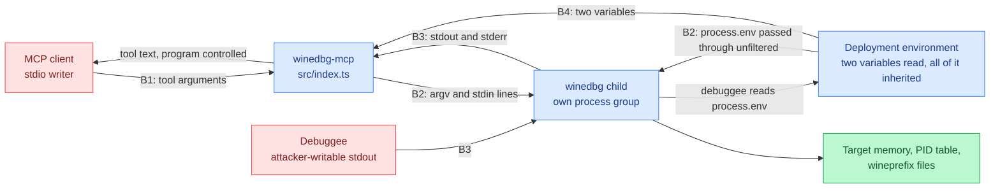

# Threat model: winedbg-mcp

Last reviewed: 2026-09-27
Owner: unset. No security owner is recorded for this repository.

Scope: the MCP server in `src/`, the deployment it assumes, and the build in
`package.json` and `.github/workflows/ci.yml`. Every entry point, boundary and
mitigation below carries a file reference so the next pass can re-verify it.
Line numbers are from the revision reviewed on the date above. That revision is
the working-tree source, which is not committed yet, so the numbers are not yet
anchored to a commit: re-check them once the tree lands.

## Risk-ranked summary

| # | Threat | Boundary | Impact | Status |
| --- | --- | --- | --- | --- |
| 1 | Any holder of the server's stdio can execute arbitrary debugger commands, which includes commands that run shell programs, read and write target memory, and attach to any PID the user can signal. This is code execution as the server's user, offered by design. | B1, B2 | Total compromise of the host account the server runs under | Unmitigated by design; the only control is who can reach the stdio |
| 2 | `spawn` passes no `env` and no `cwd` (`src/session.ts:68`), so winedbg and the debuggee inherit the launcher's whole environment and working directory. A debuggee is a program the person supplying the target chooses, and it can read every variable the MCP client passed to the server. | B2, B3 | Whatever the host keeps in the server's environment is readable and exfiltratable by the debuggee. It reaches the model's summary as "the environment holds no secrets", which is true of the two variables this code reads and false of the environment the process runs in | Unmitigated |
| 3 | A debuggee's stdout is indistinguishable from the debugger's. A program under debug that prints `Wine-dbg>` forges the prompt, ends a reply early, and hides the rest of the output from the caller. | B3 | Wrong debugging conclusions; an operator is told the program's output stopped where the attacker chose | Unmitigated |
| 4 | Debuggee output is returned to the caller verbatim as tool text, so program-controlled bytes reach the LLM that drives the server. | B1, B3 | Prompt injection into the agent: the debugged program can steer the tool-using model | Unmitigated |
| 5 | The stdio transport has no authentication. Any process that inherits or reaches the fds is a full client. | B1 | Same as #1, reached through a weaker path | Unmitigated; the only control is how the client is launched |
| 6 | `stop()` clears the session before the process group is gone (`src/session.ts:333`), so a client that alternates `winedbg_start` and `winedbg_stop` leaves up to `KILL_GRACE_MS` of live debugger per cycle and can accumulate detached process groups faster than they die. | B1, B2 | Resource exhaustion: orphaned debuggees holding memory, CPU and the user's file access with no owner | Unmitigated |
| 7 | A timed-out command leaves the session refusing commands until `winedbg_stop` destroys the debugging state. | B1 | Denial of service against the session, loss of the target's state | Partial: `winedbg_stop` and restart recover it (`src/session.ts:279`) |
| 8 | A reply is buffered up to 1M characters and returned whole, roughly 250k tokens of program-controlled text in one tool result. | B1, B3 | Cost and context exhaustion in the client; the model reads attacker-chosen text at length | Bounded by `MAX_BUFFER_CHARS` (`src/session.ts:12`), unbounded in count |
| 9 | The child is spawned in its own process group and survives this process if it is killed outright. | B2, B4 | Orphaned debuggee keeps running with no owner | Partial: `process.on("exit")` covers normal exits (`src/index.ts:155`); SIGKILL does not |
| 10 | Tool failures return the caught error's message verbatim (`src/index.ts:140`), including spawn errors that carry the resolved binary path. | B1 | Deployment reconnaissance: filesystem layout and interpreter paths handed to whoever asks | Unmitigated |
| 11 | CI never runs `bun run build` (`.github/workflows/ci.yml:11-18`), so the `build/index.js` the package exposes as `bin` (`package.json:8`) is not the artifact the tests exercise. | B5 | A build that diverges from the tested source ships unchecked | Unmitigated |
| 12 | CI actions are referenced by tag, not by commit, and the workflow sets no `permissions:` block, and it runs `bun test` on pull-request code. | B5 | A moved upstream tag or a too-broad token changes what CI runs and can read | Unmitigated |
| 13 | No command, argument or start attempt is logged. The server writes three lines to stderr, all about itself: a configuration error (`src/index.ts:21`), the startup line (`src/index.ts:178`) and a fatal startup failure (`src/index.ts:182`). | All | No trail to investigate an incident from | Unmitigated |

Nothing this code reads is a secret store: the two variables it parses are
non-secret knobs and neither is written anywhere (`src/config.ts:6-14`,
`src/config.ts:37`). That is a statement about this repository's configuration,
not about the environment the process inherits, which is row 2. Confidentiality
of the caller's own data is not a boundary this server defends; it is a pipe.

## 1. Attack surface inventory

Entry points in the code, with the handler that receives each:

| Entry point | Type | Location | Validation |
| --- | --- | --- | --- |
| JSON-RPC over stdio | Transport | `src/index.ts:170` | None at the transport; the SDK frames messages |
| `tools/list` | Request handler | `src/index.ts:84` | None; returns static metadata |
| `tools/call` | Request handler | `src/index.ts:88` | Per-tool, below |
| `winedbg_start` `args` | Tool argument, reaches `spawn` argv | `src/index.ts:93`, `src/session.ts:68` | `requireStringArray` (`src/validate.ts:8`): type only, no length or content check |
| `winedbg_execute` `command` | Tool argument, reaches the debugger's stdin | `src/index.ts:107`, `src/session.ts:319` | `requireString` (`src/validate.ts:16`); single line enforced at `src/session.ts:285` |
| `winedbg_execute` `timeout` | Tool argument | `src/index.ts:108` | `optionalTimeout` (`src/validate.ts:23`): 1 to 600000 ms |
| `winedbg_stop` | Tool argument, none | `src/index.ts:121` | None needed |
| Caught error text returned as tool text | Response carrying child and OS failure detail | `src/index.ts:140` | None; the message is passed through as produced |
| `WINEDBG_MCP_BINARY` | Environment, names the executable | `src/config.ts:6`, read at `src/index.ts:19` | Non-empty after trim (`src/config.ts:45`); unknown `WINEDBG_MCP_*` names abort startup (`src/config.ts:24`) |
| `WINEDBG_MCP_READY_TIMEOUT_MS` | Environment | `src/config.ts:7` | Digits only, 1 to 600000 (`src/config.ts:55`) |
| The rest of the process environment | Inherited by winedbg and by whatever winedbg starts | `src/session.ts:68` (no `env` given) | None; `spawn` defaults to inheriting `process.env` whole |
| The server's working directory | Inherited by the child; resolves a relative binary and a relative `args[0]` | `src/session.ts:68` (no `cwd` given) | None; `spawn` defaults to the server's cwd |
| winedbg stdout and stderr | Child output stream, includes the debuggee's | `src/session.ts:99-115` | Buffer cap `src/session.ts:214`; no content check |
| Child stdin EPIPE | Stream error event | `src/session.ts:80` | Swallowed on purpose, reported through the command promise |
| SIGINT, SIGTERM, stdin `end`, `close` and transport close | Process signals and stream events | `src/index.ts:155-179` | None |

Surface added by the toolchain, not by this code:

- `build/index.js` is published as a `bin` and is a compiled copy of `src/`
  (`package.json:8-10`, `tsconfig.json:6`). It runs with whatever authority
  launched it and needs no build step at run time. There is no `files` list and
  no publish script, so what a registry would carry is not defined anywhere in
  the repository.
- This code opens no network socket, no file and no database. The child does:
  `winedbg` reaches the target through ptrace and talks to the Wine server, and
  the debuggee is an ordinary program with the server user's network and file
  reach. The remote surface this repository adds is the inherited stdio pair.
- CI pulls `actions/checkout@v4` and `oven-sh/setup-bun@v2` and runs
  `bun install --frozen-lockfile`, `bun run typecheck` and `bun test`
  (`.github/workflows/ci.yml:12-18`). It does not run `bun run build`.

Entry points the model previously listed and the code no longer has: none. The
three tools in `src/index.ts:41-82` are the complete tool surface.

## 2. Trust boundaries and data flow

**B1: client to server.** Everything arriving over stdio is untrusted,
including the tool name (`src/index.ts:89`) and both tool arguments. The
validation point is `src/validate.ts`, which checks JSON types and ranges and
nothing else: any string is an acceptable debugger command, and any array of
strings is an acceptable argv.

**B2: server to winedbg.** The server runs `spawn(this.binary, args)` with an
argument array and no shell (`src/session.ts:68`), so no shell metacharacter
reaches a shell. That removes one class of injection and none of the authority:
winedbg is a debugger, its command set includes running and attaching to
processes, and the caller chooses the argv (`winedbg_start` accepts a PID, see
`src/index.ts:44`). The privilege transition is the important one: at this
boundary the caller's data becomes execution as the user running the server.
The spawn options name `stdio` and `detached` and nothing else, so the child
also inherits `process.env` whole and the server's working directory. A
deployment that launches this server from a shell or a client configuration
with credentials in the environment hands them to winedbg, and winedbg hands
them to the program under debug. That program is chosen by whoever supplies the
target, and reading its environment is ordinary for it.

**B3: winedbg to server.** The child's stdout and stderr are concatenated into
one buffer (`src/session.ts:99-115`) with no provenance. A debuggee writes to
the same pipe, so the server cannot tell debugger output from program output.
Framing depends on the string `Wine-dbg>` appearing in that merged stream
(`src/session.ts:3`, `src/session.ts:91`, `src/session.ts:249`), which is
program-controlled text. The same pipe is the channel a debuggee uses to return
what it found in the environment it inherited through B2, and there is no step
that classifies what comes back.

**B4: environment to server.** Read once, before anything else
(`src/index.ts:19`). Whoever sets `WINEDBG_MCP_BINARY` chooses the executable
that B2 spawns. This is a deployment-configuration trust boundary, and the only
one an attacker has to reach to get code execution without a client. It is also
the boundary whose blast radius the rest of the process shares: the same
environment is passed through untouched to the child (B2).

**B5: build to runtime.** `tsc` emits `build/index.js` from `src/` and the
package exposes it as `bin` (`package.json:8-10`). CI typechecks and tests the
TypeScript sources but never runs the build, so nothing verifies that the
emitted `build/index.js` matches them. The committed `bun.lock` and
`--frozen-lockfile` pin what CI installs (`.github/workflows/ci.yml:16`), which
covers transitive drift in CI and nothing outside it: a consumer installing the
published `bin` resolves `^1.5.0` for the MCP SDK (`package.json:19`) with no
lockfile in reach. The action tags are not pinned either.

**Secrets.** This code reads two variables and neither is written anywhere
(`src/config.ts:6-14`, `src/config.ts:37`); the README claim that the
configuration environment holds no secrets is accurate for the variables the
server itself interprets (`README.md:50`). It is not a statement about the rest
of the environment, which is inherited whole by the child (B2). Credentials that
an MCP client puts in the server's environment are a deployment asset that this
server forwards to an untrusted program without being asked to.

## 3. Assets and impact

- **Code execution as the server's user.** Reachable through B1 and B2. The
  blast radius is everything that account can read or write: the filesystem, the
  wineprefix, SSH keys in its home, the network it is attached to.
- **Target memory and register state.** A debugger reads arbitrary memory of
  the process it is attached to, and `winedbg_start` accepts a PID
  (`src/index.ts:44`). Anything secret inside the debuggee's address space is
  readable, and nothing in this server limits which PID.
- **The wineprefix and the debugged filesystem.** The debuggee writes where it
  wants; the debugger can write memory and files. Damage here is silent and
  persists after the session ends.
- **Integrity of the debugging result.** Register values, backtraces and program
  output that the caller reads as fact, and that B3 lets a program forge.
- **The caller's model context.** Up to 1M characters of program-controlled text
  per reply reach the LLM (B1, `src/session.ts:262`).
- **The launcher's environment.** Whatever the host puts in the variables used
  to start this server. A debuggee can read all of it and print it back through
  the same pipe its output already uses (B2, B3, `src/session.ts:68`).
- **The debuggee's own reach.** A program under debug runs with the server
  user's filesystem and network position. An attacker who supplies a target
  inherits that, whether or not the caller ever intended to run it.
- **Session availability.** One debugger at a time
  (`src/session.ts:58`), one command in flight (`src/session.ts:271`).

## 4. Threats per boundary

### B1, client to server

- **Elevation of privilege.** A client, or anything an LLM reads, calls
  `winedbg_execute` with a command that runs a program or attaches to a PID
  (`src/session.ts:319`, `src/index.ts:107`). Nothing distinguishes a debugging
  command from an execution command.
- **Tampering.** A caller sets `args` to any program path or PID
  (`src/validate.ts:8`).
- **Information disclosure.** `winedbg_execute` returns target memory content
  to the client with no classification step. A tool failure returns the caught
  error's message as it stands (`src/index.ts:140`), which for a failed spawn
  carries the resolved interpreter path and the OS error, so an unauthenticated
  caller can map the deployment's filesystem by starting sessions against paths
  that do not exist.
- **Denial of service.** A `timeout` of 600000 holds a tool call for ten
  minutes (`src/validate.ts:27`). A timed-out command blocks the next one until
  the prompt returns, and the only escape is `winedbg_stop`, which destroys the
  session (`src/session.ts:279`). An unbounded `args` array is also accepted.
  And `stop()` returns as soon as it has signalled the process group
  (`src/session.ts:333-356`), without waiting for the child to close, so a
  client that alternates start and stop leaves each previous debuggee alive for
  up to `KILL_GRACE_MS` (`src/session.ts:14`) and can pile up detached process
  groups faster than they exit.
- **Repudiation.** Nothing records which client ran which command.

### B2, server to winedbg

- **Elevation of privilege.** `WINEDBG_MCP_BINARY` names the executable
  (`src/config.ts:31`), so control of the launcher's environment is control of
  the process. The value is logged at startup (`src/config.ts:37`,
  `src/index.ts:178`), which discloses the path but no secret.
- **Tampering.** The `args` array is passed unchanged, so a relative path or a
  name found on `PATH` resolves wherever the server's `PATH` points, and a
  relative `args[0]` resolves against the server's working directory, since
  neither `cwd` nor `env` is set on the spawn (`src/session.ts:68`).
- **Information disclosure.** The child inherits the launcher's whole
  environment and working directory and passes both to the program under debug.
  Nothing in this server filters them, and the program under debug is
  attacker-supplied in the common case of a downloaded or third-party sample.
- **Denial of service.** The child is `detached` (`src/session.ts:63`). A
  SIGKILL of the server skips the exit handler at `src/index.ts:155` and leaves
  the debugger and its debuggee running in their own process group.

### B3, winedbg to server

- **Spoofing.** A debuggee that writes `Wine-dbg>` to its stdout satisfies
  `checkOutput` (`src/session.ts:236-265`) and ends the reply wherever it likes.
  `lastIndexOf` means it can also append a prompt to swallow output that
  followed.
- **Tampering.** The pre-command buffer is cleared at `src/session.ts:317`, so
  bytes that arrived between commands are discarded rather than attributed.
- **Information disclosure.** Everything the child writes is returned to the
  client, including output of programs the caller did not intend to expose, and
  a program that dumps the environment it inherited at B2 reaches the client
  this way.
- **Denial of service.** Continuous output is bounded to `MAX_BUFFER_CHARS`
  (`src/session.ts:12`, `src/session.ts:214`), and the drop is reported in the
  reply (`src/session.ts:262`) rather than silently. The bound is per reply, not
  per session, so a program that prompts frequently can be expensive in total.

### B4, environment to server

- **Spoofing and elevation.** Anything that can set the launcher's environment
  (CI job definition, MCP client config file, container spec) chooses the binary
  and both timeouts. There is no signature or allowlist on the path.
- **Information disclosure.** The same environment is handed to the child whole
  and on to the program under debug (`src/session.ts:68`). A launcher that
  shares one environment between this server and the rest of the agent's
  tooling shares every credential in it with whoever supplies the target.

### B5, build to runtime

- **Tampering.** Floating action tags in `.github/workflows/ci.yml:12-13` and
  no `permissions:` block mean the workflow runs with the repository's default
  token scope, and the job executes the code a pull request supplies
  (`.github/workflows/ci.yml:17-18`).
- **Tampering.** CI never runs `bun run build`, so the emitted `build/index.js`
  that the package ships as its `bin` is unverified against the sources CI does
  test (`package.json:8-12`).
- **Tampering.** The published artifact declares a caret range for the MCP SDK
  and ships no lockfile, so what a consumer runs is decided by whatever
  satisfies `^1.5.0` on the day they install (`package.json:18-20`).

## 5. Mitigations mapping

Present in the code:

| Control | Covers | Location |
| --- | --- | --- |
| Argument type and range checks before use | Malformed tool calls reaching the child | `src/validate.ts:8`, `src/validate.ts:16`, `src/validate.ts:23` |
| `spawn` with an argv array, no shell | Shell metacharacter injection at B2 | `src/session.ts:68` |
| Single-line command rejection | Prompt desynchronisation from a multi-line command | `src/session.ts:285` |
| One command in flight | Two callers interleaving output | `src/session.ts:271` |
| Refusal while an abandoned prompt is owed | Output from a timed-out command reaching the wrong caller | `src/session.ts:279`, `src/session.ts:181` |
| Buffer ceiling with a reported drop | Unbounded memory growth from a noisy debuggee | `src/session.ts:12`, `src/session.ts:214`, `src/session.ts:262` |
| Process-group termination on stop, exit and signals | Orphaned debuggee after a clean shutdown | `src/session.ts:191`, `src/index.ts:155`, `src/index.ts:166` |
| Configuration validated at startup, unknown names rejected | A typo or bad value surfacing as a mid-session failure | `src/config.ts:24`, `src/config.ts:45`, `src/config.ts:55` |
| No secret read, logged or stored by this code | Nothing to disclose through the server's own configuration | `src/config.ts:6-14`, `src/config.ts:37` |
| Frozen lockfile in CI | Dependency drift in CI only; it does not cover a consumer of the published `bin` | `.github/workflows/ci.yml:16` |

Absent, ranked by exploitability then impact:

1. **No authentication on the stdio transport.** Whoever writes to the server's
   stdin is a full client, with the authority in row 1 of the summary. There is
   no handshake, no capability token and no allowlist of clients, and the SDK's
   stdio transport has no hook for one.
2. **No filtering of the environment handed to the child.** A deployment
   cannot tell this server to withhold variables from the program under debug,
   because the spawn passes none (`src/session.ts:68`). Passing a constructed
   `env` is a deployment-visible change, not a default, and it has to be a
   decision someone makes.
3. **No restriction on what winedbg may be asked to do.** A command allowlist
   would need to be defined against the debugger's real command set, which
   changes with the Wine version; the model records the gap rather than
   prescribing the list.
4. **No provenance separation between debugger and debuggee output.** A prompt
   on a channel distinct from the program's, or a stream dedicated to program
   output, is the only way to make row 3 of the summary detectable, and to stop
   row 2's disclosure from looking like ordinary debug output.
5. **No consent step for destructive or outward-facing debugger commands.**
6. **No audit trail.** Nothing the server writes records an action taken on
   the caller's behalf: commands, their arguments, their timeouts and the sizes
   of the replies are not logged anywhere (`src/index.ts:178`).
7. **No length bound on `args`, and no wait for the child to exit in `stop()`**,
   so a client can both overflow the argument vector and accumulate live
   process groups.
8. **Sanitisation of error text before it reaches the caller** (`src/index.ts:140`).
9. **CI token scope, unpinned action tags, an unbuilt artifact and a caret
   dependency range in the published `bin`** (`.github/workflows/ci.yml`,
   `package.json`).

Claims to verify before anyone relies on them: the README states that the
configuration environment holds no secrets and that there is no config file
(`README.md:50-51`), and the code agrees for the two variables the server
interprets. The claim is easy to over-read as "this process has no secrets",
which the inherited environment at B2 contradicts. No other security claim in
the repository is made, and none of the mitigations listed above is claimed in
prose anywhere.

Single points of failure carrying several high-impact threats:

- `WinedbgSession` is the only place output is framed and the only place a
  command is sent. Its prompt string assumption (`src/session.ts:3`) underpins
  every anti-desync control listed above.
- The stdio transport is the sole gate for all caller input, and it has no
  authentication layer to bypass or to rely on.
- The `spawn` options block (`src/session.ts:68`) is the single place the
  child's authority is defined, and it is three keys long. Everything the
  debuggee can reach that the caller cannot, it reaches through what is absent
  there.
- The server's OS user is the whole blast radius for every row in the summary.

## 6. Abuse cases

Documented from the code path that enables each. None of these was attempted
against a running server.

- **A prompt-injected model becomes a shell.** A document the model reads
  contains instructions; the model calls `winedbg_execute` with a command that
  runs a program. Path: `src/index.ts:107` to `src/session.ts:319`. The only
  checks are non-empty string and no newline.
- **A debugged program dictates the answer.** The program prints the prompt
  string and a clean-looking result of its own, then its real output follows.
  The caller sees the reply end where the program chose. Path:
  `src/session.ts:99-115` to `src/session.ts:212-233`.
- **A debugged program spends the caller's tokens.** It emits 1M characters per
  prompt in a loop. Path: `src/session.ts:262`, with the per-reply ceiling at
  `src/session.ts:12`.
- **Read another process.** `winedbg_start` with a PID the server's user can
  signal attaches the debugger to it, and `winedbg_execute` reads its memory.
  Path: `src/index.ts:93` to `src/session.ts:68`.
- **The debuggee reads the launcher's secrets.** A target that prints its own
  environment returns whatever the host kept in the server's environment, on
  the same pipe as its normal output, framed as an ordinary reply. Path:
  `src/session.ts:68` (no `env` on the spawn) to `src/session.ts:262`.
- **Accumulate debuggees.** Alternating `winedbg_start` and `winedbg_stop`
  never waits for the previous process group to die, so a client that loops the
  pair leaves one live target per cycle. Path: `src/session.ts:333-356` with
  `KILL_GRACE_MS` at `src/session.ts:14`.
- **Map the deployment's filesystem.** A `winedbg_start` naming a path that
  does not exist returns the spawn failure's own text, including the resolved
  binary path. Path: `src/index.ts:93` to `src/session.ts:138`.
- **Wedge the session.** A command that never returns holds the debugger, and
  the refusal at `src/session.ts:279` means the only recovery is a stop that
  discards the target's state.
- **Trust placed in the client.** Everything about who may call the tools, and
  which commands they may issue, is the client's problem. The server validates
  JSON shape and assumes the rest (`src/validate.ts:5`).

## 7. Document quality and SECURITY.md

There is no `SECURITY.md` and no disclosure contact, supported-versions table
or security policy in the repository. This model does not invent one: a
disclosure route and a security owner are decisions for whoever owns the
project, and leaving them unset is visible here rather than implied elsewhere.

The model is current as of the last-reviewed date above. Two limits on it are
worth knowing before relying on it. The `src/` tree it reads is not committed
yet, so the line numbers are not anchored to a revision and a rebase can move
them under the text. And the entry-point and boundary tables are the parts that
go stale first: a change to `src/index.ts`, `src/session.ts` or
`src/validate.ts`, and to the `spawn` options at `src/session.ts:68` above any
other line, means re-checking them.

## 8. Response readiness

Noted only; this review builds no infrastructure.

- Security-relevant events have no audit trail. A command that destroyed state,
  a session killed by a timeout, or an output drop at `src/session.ts:262`
  leaves nothing behind except the caller's own transcript. The clearest case is
  row 2 of the summary: a debuggee that printed the launcher's environment and
  exited normally is recorded nowhere, so it is indistinguishable after the fact
  from a session that did nothing.
- There is no documented path from a reported vulnerability to a shipped fix:
  no security policy, no contact, and no branch or release process described in
  the repository.
- No version in this repository records a security fix. `package.json:3` is at
  `1.0.0` and the history has no security-related change.
