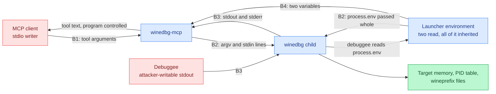

# Threat model: winedbg-mcp

Last reviewed: 2026-09-27
Owner: unset. No security owner is recorded for this repository.
Status: partly verified. Rows and sections marked [verified] are read off
source; the rest are still read off the README.

## Scope and verification status

The repository holds the server: `src/`, `tests/`, `package.json`,
`tsconfig.json`, `bun.lock` and a CI workflow that runs the typecheck and the
suite. The server is described in prose in `README.md`, and implemented in
`src/`: the entry point and tool dispatch in `src/index.ts`, the command line
in `src/cli.ts`, the tool list and the call handler in `src/tools.ts`, the
session, framing and reply buffer in `src/session.ts`, the process and clock
the session reaches the outside world through in `src/runtime.ts`, the
environment parsing in `src/config.ts`, the tool argument checks in
`src/validate.ts` and the shared limits in `src/constants.ts`.

Every claim below is split by how it is supported:

- **[design]** is read off the README or off the intended architecture, and is
  not confirmed against a file in this repository.
- **[verified]** is checked against a file in this tree, and carries a line
  reference that resolves here.

A reference in this document has to resolve to the text it backs, not merely to
a line inside the file. An unresolvable or off-target citation is worse than
none, because a reader assumes it was checked. `README.md` is a living file and
this model edits it rarely, so every reference here is re-checked whenever the
README changes. Where the code location matters and cannot be cited, the model
names the file the control belongs in and marks it unanchored.

Section 7 says what to check first.

## Risk-ranked summary

Ranked by exploitability first, then by impact. Every row names the boundary it
lives on and the code that makes it reachable. Nothing in this list has been
demonstrated against a running server: no server was started and no traffic was
crafted. Each row is a record for sec-review, not a fix.

| # | Threat | Boundary | Impact | Status in the code |
| --- | --- | --- | --- | --- |
| 1 | Any holder of the server's stdio can issue arbitrary debugger commands, which include commands that run shell programs, read and write target memory, and attach to any PID the user can signal. This is code execution as the server's user, offered by design. | B1, B2 | Total compromise of the host account the server runs under | Unmitigated by design; the only control is who can reach the stdio |
| 2 | The child inherits the launcher's whole environment and working directory (`README.md:79-84`), so winedbg and the debuggee get every variable the MCP client passed to the server. A debuggee is a program the person supplying the target chooses, and reading its environment is ordinary for it. | B2, B3 | Whatever the host keeps in the server's environment is readable and exfiltratable by the debuggee. It reaches the model as "the environment holds no secrets" (`README.md:76-77`), which is true of the two variables this server reads and false of the environment the process runs in | Unmitigated. `spawn` passes no `env` and no `cwd` (`src/runtime.ts:124-132`) |
| 3 | `WINEDBG_MCP_BINARY` names the executable that `spawn` runs, so whoever sets it chooses the program, with no signature, allowlist or path check. | B4 | Code execution as the server's user with no MCP client involved at all | Unmitigated. Validated for emptiness and a NUL byte only (`src/config.ts:41-54`) |
| 4 | A debuggee's stdout is indistinguishable from the debugger's (`README.md:110-112`). A program under debug that prints `Wine-dbg>` can end a reply at a point of its choosing, hiding whatever output follows. | B3 | Wrong debugging conclusions; an operator is told the program's output stopped where the attacker chose | Unmitigated. The first prompt from the search position is the boundary (`src/session.ts:243`) |
| 5 | Debuggee output reaches the caller as tool text, so program-controlled bytes reach the LLM driving the server. It is decoded as UTF-8 first (`README.md:126-134`), so a program printing non-UTF-8 bytes is returned as U+FFFD, which mangles the output without changing its authority. | B1, B3 | Prompt injection into the agent: the debugged program can steer the tool-using model. A target that prints in a legacy code page has its output silently rewritten, so a mangled reply can be read as a correct one | Unmitigated |
| 6 | The stdio transport has no authentication. Any process that inherits or reaches the fds is a full client. | B1 | Same as #1, reached through a weaker path | Unmitigated; the only control is how the client is launched. `StdioServerTransport` is constructed with no options (`src/index.ts:57`) |
| 7 | `stop()` clears the session and signals the child process group, but returns without waiting for it to exit (`src/session.ts:340-363`, `src/session.ts:195-201`). A client alternating `winedbg_start` and `winedbg_stop` leaves a live debugger and debuggee per cycle and can accumulate detached process groups faster than the 2s grace kill reaches them. | B1, B2 | Resource exhaustion: orphaned debuggees holding memory, CPU and the user's file access with no owner | [verified] Partial. The group is signalled with `SIGTERM`, escalating to `SIGKILL` after a 2s grace, and `tests/session.test.ts` covers the debuggee dying with the debugger. `stop()` itself returns on the signal, so a tool call is never held open by it; the wait happens where it costs nothing, in the next `start` (`awaitTerminations`) and in `WinedbgSession.shutdown`, which the process exit paths use so the escalation is not cut short by the exit. A client that stops and never starts again, and never exits, still relies on that escalation alone |
| 8 | A `timeout` of up to 600000 holds a tool call for ten minutes, and a timed-out command leaves the session refusing commands until `winedbg_stop` destroys the debugging state (`README.md:120-124`). | B1 | Denial of service against the session, loss of the target's state | Partial: `winedbg_stop` and restart recover it (`src/session.ts:276-281`, `src/session.ts:299-303`) |
| 9 | A reply is buffered up to 1M UTF-16 code units and returned whole, roughly 250k tokens of program-controlled text in one tool result (`README.md:126-134`). | B1, B3 | Cost and context exhaustion in the client; the model reads attacker-chosen text at length | Bounded per reply, unbounded in count (`src/session.ts:9`) |
| 10 | Each chunk of child output is decoded on its own (`src/runtime.ts:73-76`), so a multibyte UTF-8 sequence split across two chunks becomes U+FFFD, and the trim at the cap cuts at a UTF-16 code unit (`src/session.ts:221-224`), which can split a surrogate pair. | B3 | Mangled program output and mangled dropped blocks, both read by the operator as a correct reply | Unmitigated; the drop is counted and reported (`src/session.ts:252`) but the mangling is not |
| 11 | The child is given a process group of its own, so a SIGKILL of the server skips `stop()` entirely and the debugger and its debuggee survive it. | B2, B4 | Orphaned debuggee keeps running with no owner | [verified] Confirmed: `detached: true` (`src/runtime.ts:130`) |
| 12 | Tool failures return the message the code produced (`README.md:176-185`), which for a failed spawn carries the resolved binary path. | B1 | Deployment reconnaissance: filesystem layout and interpreter paths handed to whoever asks | Unmitigated for spawn and OS errors (`src/tools.ts:97-101`). The session-state errors are a fixed set of five strings (`src/session.ts:72`, `src/session.ts:268`, `src/session.ts:271`, `src/session.ts:277`) and disclose nothing |
| 13 | Nothing in the design records a command, an argument, a timeout or a reply size. | All | No trail to investigate an incident from | Unmitigated. The only output is the startup line and the error text (`src/index.ts:65`, `src/index.ts:17`) |
| 14 | The build emits `build/index.js` and the client configuration points at it (`README.md:40-57`, `README.md:57-72`). CI runs the typecheck and the suite (`.github/workflows/ci.yml`), but the compiled artifact is neither committed nor checksummed, so what a consumer runs is whatever `bun run build` produced on their machine. `build/` is gitignored, and `package.json` ships only `build` in `files`. | B5 | A build that diverges from tested source ships unchecked | Partial: CI checks the sources; nothing checks the artifact a consumer runs |
| 15 | `package.json` and `bun.lock` are in the tree and CI installs with `--frozen-lockfile`, but the workflow's actions are pinned to major tags (`actions/checkout@v4`, `oven-sh/setup-bun@v2`) rather than commit SHAs, and it sets no `permissions:`, so the default token scope applies to the job. | B5 | Supply-chain drift decided by whatever satisfies a tag on the day the workflow runs | Unmitigated; the frozen install covers the dependency tree but not the action tags |
| 16 | The same artifact has three documented run paths: `bun` on `build/index.js` (the client configuration, `README.md:57-72`), `node` 18 or higher on that same file (`README.md:37-38`), and the sources directly under `bun run dev`, skipping the build (`README.md:52-53`). Only the first is exercised by the documented configuration, and `node` is named as a floor with no upper bound; `bun@1.4.0` is pinned in `package.json` and is what CI uses. | B5, B2, B3 | A deployment that swaps `bun` for `node` gets a different stream decoder, process-group and `TextDecoder` behaviour than the one the reply rules at `README.md:126-134` describe, with no artifact showing the difference | Unmitigated; the `node` path is never exercised by the suite |

Nothing this server reads is a secret store: the two variables it parses are
non-secret knobs and neither is written anywhere (`README.md:76-77`,
`src/config.ts:6-7`), and the startup line prints only those two values
(`src/config.ts:37-39`, `src/index.ts:65`). That is a
statement about this server's own configuration, not about the environment the
process holds, which is row 2.

## 1. Attack surface inventory

### Entry points, all of them

| Entry point | Type | Reaches | Validation |
| --- | --- | --- | --- |
| JSON-RPC over stdio | Transport | client configuration, `README.md:57-72` | None at the transport (`src/index.ts:57`) |
| Command-line arguments | Process argv, set by whoever launches the server, printed to the operator on an unknown one | The command line section of `README.md` | Only `-h`, `--help` and `--version` are accepted; every other argument, including a positional one, raises a usage error naming it and exits 2, before the environment is read (`src/cli.ts:49-62`, `src/index.ts:19-36`). No argument value reaches the child |
| Runtime and path the client launches | Deployment choice, `bun` or `node` 18+ on the built file, or the sources under `bun run dev` | `README.md:37-38`, `README.md:52-53` | None. The client configuration pins `bun` (`README.md:63`); the README also sanctions `node`, and the `node` requirement is a floor with no upper bound |
| `tools/list` | Request | A fixed tool list built once (`src/tools.ts:16`, `src/index.ts:35-37`) | None needed |
| `winedbg_start` `args` | Tool argument, reaches the child's argv | `README.md:103` | None stated; the array is passed through unchanged, with no length or content check, after an element-wise string check (`src/validate.ts:8-23`, `src/tools.ts:77`) |
| `winedbg_execute` `command` | Tool argument, reaches the debugger's stdin | `README.md:104` | Non-empty, carrying no line terminator (`\n`, `\r`, vertical tab, form feed, NEL, U+2028, U+2029); no allowlist of debugger commands (`src/validate.ts:25-30`, `src/session.ts:18`, `src/session.ts:287`) |
| `winedbg_execute` `timeout` | Tool argument | `README.md:105` | Bounded, 1 to 600000 ms (`src/validate.ts:32-42`) |
| Tool name | Tool argument | The switch in the call handler (`src/tools.ts:75-96`) | Unknown names raise `MethodNotFound` and are re-thrown rather than returned as a result (`src/tools.ts:95`, `src/tools.ts:98`) |
| `winedbg_stop` | Tool argument, none | `README.md:106` | [verified] None needed; `stop()` in `src/session.ts` returns without waiting for the child to exit, having signalled its process group |
| Error text returned as tool text | Response carrying child and OS failure detail | `README.md:176-185` | None; the message is passed through as produced (`src/tools.ts:97-101`) |
| `WINEDBG_MCP_BINARY` | Environment, names the executable | `README.md:86-89` | Non-empty, NUL-free, read once (`src/config.ts:41-54`); an unknown `WINEDBG_MCP_*` name aborts startup (`src/config.ts:24-28`, `README.md:91-95`) |
| `WINEDBG_MCP_READY_TIMEOUT_MS` | Environment | `README.md:86-89` | Whole milliseconds, 1 to 600000 (`src/config.ts:56-67`) |
| The rest of the process environment | Inherited by winedbg and by whatever winedbg starts | `README.md:79-84` | None; `spawn` passes no `env` (`src/runtime.ts:124-132`) |
| The server's working directory | Inherited by the child; resolves a relative binary and a relative `args[0]` | `README.md:79-84` | None; `spawn` passes no `cwd` (`src/runtime.ts:124-132`) |
| winedbg stdout and stderr | Child output stream, including the debuggee's | `README.md:110-112` | Decoded as UTF-8 per chunk, 1M UTF-16 code unit cap per reply, trimmed at a code unit; no content check (`src/runtime.ts:73-76`, `src/session.ts:9`, `src/session.ts:204-209`) |
| SIGINT, SIGTERM, stdin `end`/`close`, process `exit`, transport close | Lifecycle | Session teardown (`src/index.ts`) | [verified] None needed; each routes to `shutdown()`, which stops the session and waits, bounded at 4s, for the debuggers it signalled to be gone. The synchronous `exit` handler cannot wait and signals only |
| Startup line on stderr | Log | `README.md:97-99` | Reports both configuration values in effect (`src/config.ts:37-39`) |

There is no network listener, no HTTP or RPC endpoint, no message consumer, no
webhook, no upload parser, no CLI argument parsing, no scheduled job and no IPC.
The whole surface is stdio plus the environment.

The one internal name the README gives is `WinedbgSession`, the class the
test suite drives against a stand-in speaking the same `Wine-dbg>`
protocol (`README.md:153-154`). That is where the spawn, the framing and the
reply buffer described throughout this model live.

Entry points a previous revision of this model listed and the specification no
longer has: none. The three tools at `README.md:103-106` are the complete tool
surface as described.

Surface contributed by dependencies and deployment: `@modelcontextprotocol/sdk`
supplies the transport and the schemas, and its `inputSchema` is not enforced by
the server, which is why `src/validate.ts` exists (`src/validate.ts:4-6`,
`src/tools.ts:20-31`). CI is the only automated gate; there is no container or
compose file in the tree.

## 2. Trust boundaries and data flow

**B1: client to server.** Everything arriving over stdio is untrusted,
including the tool name and both tool arguments. The specified validation is
type and range checking. What the README states is that `winedbg_execute` takes
a command string and an optional timeout defaulting to 30000 with a maximum of
600000 (`README.md:104-105`), that a command carrying a line terminator is rejected
(`README.md:108-125`), and that `args` is a string array passed through unchanged
(`README.md:103`). Nothing in that description bounds argument length, restricts
which debugger commands may be sent, or distinguishes a debugging command from a
command that runs a program. [verified] What the code checks is the same thing
and nothing more: `requireStringArray`, `requireString` and `optionalTimeout`
(`src/validate.ts:8-42`), the call handler's switch (`src/tools.ts:75-96`), and
the single-line rule in the session (`src/session.ts:18`, `src/session.ts:287`).

**B2: server to winedbg.** `winedbg_start` passes the caller's `args` through
unchanged, including a PID (`README.md:103`), and winedbg is a debugger whose
command set includes running and attaching to processes. Whether it is started
with an argument array and no shell, or through a shell, is not stated in the
README; if it is the former, no shell metacharacter reaches a shell, which
removes one class of injection and none of the authority. [verified] It is the
former: `spawn(binary, args, { stdio, detached })` with no `shell`
(`src/runtime.ts:124-132`). The privilege transition is the point either way: at
this boundary the caller's data becomes execution as the user running the server.

The README records that winedbg is started with the server's whole environment
and working directory inherited (`README.md:79-84`). Nothing in the described
server filters them. [verified] Nothing filters them: the spawn options name no
`env` and no `cwd` (`src/runtime.ts:124-132`). A deployment that launches it from
a shell or a client configuration with credentials in the environment hands them
to winedbg, and winedbg hands them to the program under debug, which is chosen by
whoever supplies the target.

**B3: winedbg to server.** The child's stdout and stderr are concatenated into
one buffer with no provenance, because winedbg offers no way to label which
output belongs to which command (`README.md:110-112`). A debuggee writes to the
same pipe, so the server cannot tell debugger output from program output.
Framing depends on the string `Wine-dbg>` appearing in that merged stream,
which is program-controlled text. The same pipe is how a debuggee returns what
it read from the environment it inherited through B2, and nothing in the design
classifies what comes back. [verified] The framing is the first prompt from the
search position, or the last prompt in the buffer after a drain, and the buffer
is cleared before each command is written, so output arriving between commands is
discarded rather than attributed to either reply (`src/session.ts:243`,
`src/session.ts:319`).

No text at this boundary is an identity. Nothing the child prints is compared
for equality against a stored value, used as a filename, a path or a lookup key,
so no normalization form is chosen for it: the decoded text is passed on as it
arrives. If a later revision compares child output against anything, that
comparison needs a normalization policy of its own.

**B4: environment to server.** Two variables are read once, at startup
(`README.md:76-77`, `README.md:86-89`): `WINEDBG_MCP_BINARY` names the executable
that B2 spawns, and `WINEDBG_MCP_READY_TIMEOUT_MS` bounds the first prompt
wait. Whoever sets them chooses the binary and the timeout. There is no
signature or allowlist on the path. This is the boundary an attacker has to
reach for code execution with no client at all. It is also the boundary with the
largest blast radius, because the same environment is forwarded whole to the
child. A value the server cannot use aborts startup with the variable named
(`README.md:91-95`, `src/config.ts:21-34`, `src/index.ts:14-19`), so a typo
fails loudly rather than running on defaults.

**B5: build to runtime.** The README's build step emits `build/index.js` and
the client configuration points at that path (`README.md:40-57`,
`README.md:57-72`). The tree does have `package.json`, `tsconfig.json`,
`bun.lock` and a CI workflow, and CI runs the typecheck and the suite, so the
sources are checked. Two things are still open: the emitted artifact is not
committed or checksummed, and `@modelcontextprotocol/sdk` is declared as
`^1.5.0` with no lockfile shipped in the package, so a consumer of the
published tarball resolves against whatever that range admits on the day of
install.

The artifact also has more than one documented way to run, a second B5
question that also reaches B2 and B3. The client configuration launches
`build/index.js` with `bun` (`README.md:57-72`), the README also sanctions
running that same file with `node` 18 or higher (`README.md:37-38`), and
`bun run dev` runs the sources with no build step at all
(`README.md:52-53`). Three things follow. A deployment on the dev path has no
build output to diverge, but also never runs the artifact B5 is about. A
deployment that swaps `bun` for `node` runs it on a runtime bounded only from
below, and the reply rules the README states (UTF-8 decoding with U+FFFD for
invalid sequences, character-counted truncation, `README.md:126-134`) and the
stream and process-group handling in B2 and B3 are exactly the behaviour that
differs between the two. And a `node` on `PATH` earlier than a deployment
expects resolves a `command` field from the client configuration, so the swap
needs no edit to the server at all.

**Secrets.** [verified] The two variables the server interprets are non-secret
knobs, and the README says so (`README.md:76-77`, `src/config.ts:6-7`). [design]
That statement covers what this server reads, not what its process holds: the
environment is inherited whole by the child (B2) and reaches the program under
debug (`README.md:79-84`). Credentials a client places in the server's environment are
a deployment asset the server forwards to an untrusted program without being
asked to. Confidentiality of the caller's own data is not a boundary this
server defends; it is a pipe.

## 3. Assets and impact (design)

- **Code execution as the server's user.** Reachable through B1 and B2. The
  blast radius is everything that account can read or write: the filesystem,
  the wineprefix, SSH keys in its home, the network it is attached to.
- **Target memory and register state.** A debugger reads arbitrary memory of
  the process it is attached to, and `winedbg_start` accepts a PID
  (`README.md:103`). Anything secret in the debuggee's address space is
  readable, and nothing in the design limits which PID.
- **The wineprefix and the debugged filesystem.** The debuggee writes where it
  wants and the debugger can write memory and files. Damage here is silent and
  persists after the session ends.
- **Integrity of the debugging result.** Register values, backtraces and program
  output that the caller reads as fact, and that B3 lets a program forge, and
  that row 10 of the summary can mangle without saying so.
- **The caller's model context.** Up to 1M UTF-16 code units of
  program-controlled text per reply reach the model (B1, `src/session.ts:9`).
- **The launcher's environment.** Whatever the host puts in the variables used
  to start this server. A debuggee can read all of it and print it back through
  the pipe its output already uses (B2, B3).
- **The debuggee's own reach.** A program under debug runs with the server
  user's filesystem and network position. An attacker who supplies a target
  inherits that whether or not the caller intended to run it.
- **Session availability.** One debugger at a time, one command in flight
  (`README.md:108-124`, `src/session.ts:267-273`).

## 4. Threats per boundary

### B1, client to server

- **Elevation of privilege.** A client, or anything an LLM reads, calls
  `winedbg_execute` with a command that runs a program or attaches to a PID
  (`README.md:104`, `src/index.ts:39-41`). Nothing in the design distinguishes a
  debugging command from an execution command.
- **Tampering.** A caller sets `args` to any program path or PID, and the server
  passes it through unchanged (`README.md:103`, `src/tools.ts:77`).
- **Information disclosure.** `winedbg_execute` returns target memory content
  to the client with no classification step. The README specifies that a tool
  failure returns the message the code produced (`README.md:176-185`), which
  for a failed spawn carries the resolved interpreter path and the OS error, so
  a caller can map the deployment's filesystem by starting sessions against
  paths that do not exist. The session-state errors are a fixed set of five
  strings (`README.md:181-185`) and disclose nothing.
- **Denial of service.** A `timeout` of 600000 holds a tool call for ten
  minutes (`README.md:105`). A timed-out command blocks the next one until the
  prompt returns, and the only escape is `winedbg_stop`, which discards the
  session's state (`README.md:120-124`). [verified] `stop()` signals the child
  process group and returns without waiting for it to exit, so a client
  alternating start and stop leaves each previous debuggee alive until the 2s
  grace kill reaches it. The next `start` waits for that group to be gone before
  spawning (`awaitTerminations`, bounded at 4s), and `WinedbgSession.shutdown`
  does the same on SIGINT, SIGTERM, stdin end and transport close, so the
  alternation cannot pile up detached process groups and an exit cannot cut the
  escalation short (row 7 of the summary).
  [design] The design says nothing about a bound on the length of `args`.
- **Repudiation.** Nothing in the design records which client ran which command.

### B2, server to winedbg

- **Spoofing and elevation of privilege.** `WINEDBG_MCP_BINARY` names the
  executable (`README.md:86-89`, `src/config.ts:41-54`), so control of the
  launcher's environment is control of the process. The startup line reports the
  value in effect on stderr (`README.md:97-99`, `src/config.ts:37-39`), which
  discloses the path and no secret.
- **Tampering.** `args` is passed unchanged, so a relative path or a name found
  on `PATH` resolves wherever the server's `PATH` points, and a relative
  `args[0]` resolves against the server's working directory, since the child
  inherits both (`src/runtime.ts:124-132`).
- **Information disclosure.** The child inherits the launcher's whole
  environment and hands it to the program under debug, which is attacker-supplied
  in the common case of a downloaded sample.
- **Denial of service.** The child is detached into its own process group
  (`src/runtime.ts:130`), so a SIGKILL of the server skips `stop()` entirely and
  leaves the debugger and its debuggee running.

### B3, winedbg to server

- **Spoofing.** A debuggee that writes `Wine-dbg>` to its stdout reaches the
  client on the same pipe the prompt arrives on (`README.md:110-112`), so the
  reply can be ended wherever the program chooses. [verified] The first prompt
  from the search position is the boundary (`src/session.ts:243`); after an
  abandoned prompt is drained the search restarts at zero and the last prompt
  becomes the boundary (`src/session.ts:231-237`), which is a different rule for
  the same stream.
- **Tampering.** How the server separates output that arrived between commands
  is not stated in the README. [verified] The buffer is cleared before each
  command is written, so those bytes are discarded rather than attributed to
  either reply (`src/session.ts:319`).
- **Information disclosure.** Everything the child writes is returned to the
  client, including output of programs the caller did not intend to expose, and
  a program that dumps the environment it inherited at B2 reaches the client
  this way.
- **Denial of service.** Continuous output is bounded to 1M UTF-16 code units
  and the drop is reported in the reply rather than silently
  (`src/session.ts:9`, `src/session.ts:252`). The bound is per reply, not per
  session, so a program that prompts frequently can still be expensive in total.
- **Integrity.** Each chunk of child output is decoded on its own
  (`src/runtime.ts:73-76`), so a multibyte UTF-8 sequence split across two
  chunks becomes U+FFFD, and the trim at the cap cuts at a UTF-16 code unit
  (`src/session.ts:221-224`), which can split a surrogate pair. Both produce a
  reply that looks complete and is not.

### B4, environment to server

- **Spoofing and elevation.** Anything that can set the launcher's environment
  (a CI job definition, an MCP client config file, a container spec) chooses the
  binary. No signature, no allowlist.
- **Information disclosure.** The same environment is handed to the child whole
  and on to the debuggee. A launcher that shares one environment between this
  server and the rest of the agent's tooling shares every credential in it with
  whoever supplies the target.

### B5, build to runtime

- **Tampering.** CI pins its actions by tag, so a moved tag changes what runs
  (`.github/workflows/ci.yml`). `bun.lock` is committed and CI installs frozen,
  which covers the dependency tree but not the actions.
- **Repudiation.** CI has no artifact of what it built; `build/` is gitignored
  and the runtime a deployment uses is a local choice (`README.md:18-19`,
  `README.md:40-57`).

## 5. Mitigations mapping

Controls that exist in the code, and the threats they cover.

| Control | Code | Covers |
| --- | --- | --- |
| Argument type and range checks before use | `src/validate.ts:8-42`, `src/tools.ts:75-96` | Malformed tool calls reaching the child |
| winedbg started with an argv array, no shell | `src/runtime.ts:124-132` | Shell metacharacter injection at B2 |
| Rejection of a command carrying any line terminator | `src/session.ts:18`, `src/session.ts:287` | Prompt desynchronisation from a second line |
| One command in flight | `src/session.ts:270-272` | Two callers interleaving output |
| Refusal while an abandoned prompt is owed | `src/session.ts:276-281`, `src/session.ts:231-237` | Output from a timed-out command reaching the wrong caller |
| Buffer ceiling with a reported drop | `src/session.ts:9`, `src/session.ts:204-209`, `src/session.ts:252` | Unbounded memory growth from a noisy debuggee |
| Child given its own process group and signalled as a group on stop and on shutdown | `src/runtime.ts:104-115`, `src/runtime.ts:130`, `src/index.ts:45`, `src/index.ts:47-54` | Orphaned debuggee after a clean stop or a clean shutdown |
| SIGKILL escalation after a 2s grace | `src/session.ts:15`, `src/session.ts:195-201` | A debugger wedged in a trap handler surviving a stop |
| Stale-child event guard | `src/session.ts:88`, `src/session.ts:103`, `src/session.ts:123` | A late event from a replaced child corrupting current session state |
| EPIPE on the command pipe swallowed | `src/runtime.ts:69` | A closed pipe taking the server process down |
| Configuration validated at startup, unknown names rejected | `src/config.ts:24-28`, `src/config.ts:41-67` | A typo or bad value surfacing as a mid-session failure |
| Exit status 1 on an unusable configuration | `src/index.ts:14-19` | A deployment that believes it started when it did not, and would otherwise run on defaults |
| Child killed when the first prompt never arrives | `src/session.ts:91-100` | A start that never completed leaving a debugger with no session |
| Lifecycle teardown on exit, signals, stdin end and transport close | `src/index.ts:45`, `src/index.ts:47-54`, `src/index.ts:62-64` | A detached debugger surviving the client |
| Unknown tool names raised as protocol errors, not results | `src/tools.ts:95`, `src/tools.ts:98` | A failed call reported as a successful one |
| Five fixed session-state error strings | `src/session.ts:72`, `src/session.ts:268`, `src/session.ts:271`, `src/session.ts:277` | Path and layout disclosure through the common failure paths |
| No secret read, logged or stored by this server | `src/config.ts:6-7`, `src/config.ts:37-39` | Nothing to disclose through the server's own configuration |

Absent, ranked by exploitability then impact:

1. **No authentication on the stdio transport.** Whoever writes to the server's
   stdin is a full client, with the authority in row 1 of the summary. There is
   no handshake, no capability token and no allowlist of clients.
2. **No filtering of the environment handed to the child** (`README.md:79-84`).
   A deployment cannot tell this server to withhold variables from the program
   under debug.
3. **No path check on `WINEDBG_MCP_BINARY`** (`src/config.ts:41-54`). The value
   is checked for emptiness and for a NUL byte, and nothing else.
4. **No restriction on what winedbg may be asked to do.** A command allowlist
   would have to be defined against the debugger's real command set, which
   changes with the Wine version; the model records the gap rather than
   prescribing the list.
5. **No provenance separation between debugger and debuggee output.** A prompt
   on a channel distinct from the program's, or a stream dedicated to program
   output, is the only way to make row 4 of the summary detectable, and to stop
   row 2's disclosure from looking like ordinary debug output.
6. **No length bound on `args` or on `command`**, and no per-session reply
   budget. `requireStringArray` and `requireString` check types only
   (`src/validate.ts:8-30`).
7. **No consent step for destructive or outward-facing debugger commands.**
8. **No audit trail.** Nothing described in `README.md` records an action taken
   on the caller's behalf: commands, their arguments, their timeouts and the
   sizes of replies are not logged. The only output the design names is a
   startup line on stderr and error text returned to the caller
   (`README.md:97-99`, `README.md:176-185`, `src/index.ts:65`).
9. **Sanitisation of error text before it reaches the caller**
   (`README.md:176-185`, `src/tools.ts:97-101`). The five session-state messages
   are fixed text (`README.md:181-185`), so what passes through unsanitised is
   the spawn and OS error, not the routine failures.
10. **No pinning of the runtime that executes the artifact.** The client
    configuration names `bun` (`README.md:57-72`) and the README also sanctions
    `node` 18 or higher (`README.md:37-38`) with no upper bound, while the reply
    rules at `README.md:126-134` state behaviour that depends on which of the two
    is doing the decoding. Nothing in this tree records which runtime the
    project tests.

Security claims in the project's own documentation, checked against the code:

| Claim | Reality |
| --- | --- |
| The two variables are non-secret and there is no config file (`README.md:76-77`) | Accurate. The server reads those two and nothing else (`src/config.ts:6-7`) |
| The child inherits the whole environment and working directory (`README.md:79-84`) | Accurate (`src/runtime.ts:124-132`) |
| A command is rejected if it carries any line terminator, naming `\n`, `\r`, vertical tab, form feed, NEL, U+2028, U+2029 (`README.md:108-125`) | Accurate. `LINE_TERMINATOR` names exactly that set (`src/session.ts:18`, `src/session.ts:287`) |
| A reply is capped at 1M UTF-16 code units and the drop is counted in the same units (`README.md:126-134`) | Accurate as to the unit. The drop cuts at a code unit, which can split a surrogate pair, and the README says so (row 10 of the summary) |
| Every tool failure returns the message the code produced (`README.md:176-185`) | Accurate (`src/tools.ts:97-101`) |
| The environment is the only place to set configuration | Accurate (`src/config.ts:21-34`) |

Single points of failure carrying several high-impact threats:

- The prompt-string assumption in `checkOutput` (`src/session.ts:226-255`) is
  the only place a reply is framed, and a debuggee writes the same string.
- The stdio transport is the sole gate for all caller input, with no
  authentication layer to bypass or to rely on.
- The spawn options are the single place the child's authority is defined
  (`src/runtime.ts:124-132`). Everything the debuggee can reach that the caller
  cannot, it reaches through what is absent there.
- The server's OS user is the whole blast radius for every row in the summary.

## 6. Abuse cases

Scenarios with the enabling code path named. None was attempted against a
running server: no server was started, no attack was carried out, and no
crafted traffic was sent.

- **A prompt-injected model becomes a shell.** A document the model reads
  contains instructions; the model calls `winedbg_execute` with a command that
  runs a program (`README.md:104`). The only specified checks are a non-empty
  string and the absence of a line terminator (`src/session.ts:287`).
- **A debugged program dictates the answer.** The program prints the prompt
  string and a clean-looking result of its own, then its real output follows.
  The caller sees the reply end where the program chose (`README.md:110-112`,
  `src/session.ts:243`).
- **A debugged program spends the caller's tokens.** It emits a capful of output
  per prompt in a loop, and nothing counts replies per session
  (`src/session.ts:9`).
- **Read another process.** `winedbg_start` with a PID the server's user can
  signal attaches the debugger to it, and `winedbg_execute` reads its memory
  (`README.md:103`).
- **The debuggee reads the launcher's secrets.** A target that prints its own
  environment returns whatever the host kept in the server's environment, on
  the same pipe as its normal output, framed as an ordinary reply
  (`README.md:79-84`, `src/runtime.ts:124-132`).
- **Accumulate orphaned debuggees.** A client alternating `winedbg_start` and
  `winedbg_stop` leaves each process group alive until the grace kill reaches
  it, because `stop()` returns immediately (`src/session.ts:340-363`).
- **Map the deployment's filesystem.** A `winedbg_start` naming a path that does
  not exist returns the spawn failure's own text, including the resolved binary
  path (`README.md:176-185`, `src/tools.ts:97-101`).
- **Wedge the session.** A command that never returns holds the debugger, and
  the refusal after a timeout means the only recovery is a stop that discards
  the target's state (`README.md:120-124`, `src/session.ts:276-281`).
- **Trust placed in the client.** Who may call the tools, and which commands
  they may issue, is the client's problem. The server validates JSON shape and
  assumes the rest.

## 7. Document quality and SECURITY.md

There is no `SECURITY.md`, no disclosure contact, no supported-versions table
and no security policy in this repository. This model does not invent one: a
disclosure route and a security owner are decisions for whoever owns the project,
and leaving them unset is visible here rather than implied elsewhere.

`package.json` is at version 1.0.0, and there is no release history in the
repository to read for security fixes.

This model is current as of the last-reviewed date above. Its limits:

- The risk-ranked summary, section 1 and the boundary section are the parts that
  go stale first. A change to the tool list, the spawn options, the framing rules
  or the buffer behaviour in `src/` or `README.md` means re-checking them.
- Every **[design]** claim is unverified. The source has since landed, and the
  first pass against it answered, in this order: the spawn passes no `env` and no
  `cwd` (`src/runtime.ts:124-132`); the reply is framed on a pipe the debuggee
  can write (`src/session.ts:243`); `stop()` does not wait for the child to exit,
  so a client alternating start and stop could leave each previous debuggee
  alive until the grace kill reached it; tool errors are not sanitised before they reach
  the caller (`src/tools.ts:97-101`); no command, argument or start attempt is
  logged anywhere; and the reply buffer counts UTF-16 code units, trims at a code
  unit and rejects every line terminator the README names
  (`src/session.ts:9`, `src/session.ts:18`). The rows that changed status are
  marked [verified] above.
- Every line reference in this file was re-checked against the current
  `README.md` and `src/` in the pass that set the last-reviewed date above. That
  is the only thing that check establishes; a citation that survives one pass is
  not
  re-verified by the next review.
- Two README claims the previous revision of this model carried forward as
  verified were false, and are now listed in section 5 as claims to check
  against the code. A README sentence is not evidence.

## 8. Response readiness

Noted only; this review builds no infrastructure.

- Security-relevant events have no audit trail. A command that destroyed state,
  a session killed by a timeout, or a dropped output block
  (`README.md:126-134`) leaves nothing behind except the caller's own
  transcript. The clearest case is row 2 of the summary: a debuggee that
  printed the launcher's environment and exited normally is recorded nowhere,
  so it is indistinguishable after the fact from a session that did nothing.
- There is no documented path from a reported vulnerability to a shipped fix:
  no security policy, no contact, and no branch or release process described in
  the repository.
- `bun test` and `bun run typecheck` are the only automated gates, and they run
  in CI on every push and pull request (`.github/workflows/ci.yml`).
